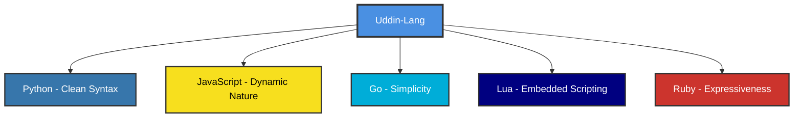
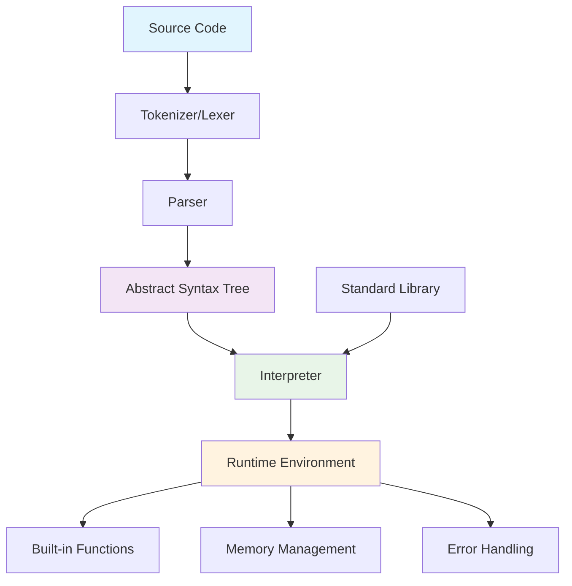
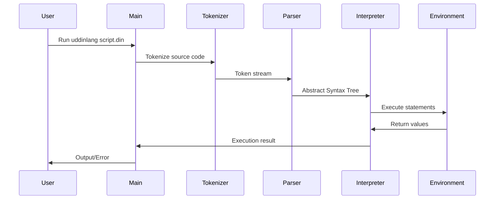

# Uddin-Lang Programming Language

> **Note**: This project is created for fun and educational purposes, based on excellent resources from:
>
> -   [Crafting Interpreters](https://craftinginterpreters.com/)
> -   [Writing An Interpreter In Go](https://interpreterbook.com/)
> -   [Let's Build A Simple Interpreter](https://ruslanspivak.com/lsbasi-part1/)
> -   [Language Implementation Patterns](https://pragprog.com/titles/tpdsl/language-implementation-patterns/)
> -   [LittleLang - Simple interpreter in Go](https://github.com/benhoyt/littlelang)
> -   [Monkey Language Interpreter in Go](https://github.com/kitasuke/monkey-go)

<div align="center">


**A Modern, Functional Programming Language with Clean Syntax**

[](https://golang.org)
[](LICENSE)
[](tests)

</div>

## 📖 Table of Contents

-   [About Uddin-Lang](#about-uddin-lang)
-   [Language Philosophy & Inspiration](#language-philosophy--inspiration)
-   [Key Features](#key-features)
-   [Quick Start](#quick-start)
-   [Language Grammar](#language-grammar)
-   [Architecture Overview](#architecture-overview)
-   [Syntax Reference](#syntax-reference)
-   [Module System](#module-system)
-   [Built-in Functions](#built-in-functions)
-   [Examples](#examples)
-   [Development](#development)
-   [Contributing](#contributing)
-   [License](#license)

---

## 🌟 About Uddin-Lang

Uddin-Lang is a modern, interpreted programming language designed with simplicity, expressiveness, and functional programming principles in mind. It combines the best features of dynamic languages with a clean, readable syntax that makes programming enjoyable and productive.

### 🎯 Design Goals

-   **Simplicity**: Easy to learn and use syntax
-   **Expressiveness**: Powerful language constructs
-   **Functional**: First-class functions and closures
-   **Dynamic**: Dynamic typing with runtime type checking
-   **Safe**: Built-in error handling and null safety concepts
-   **Modern**: Contemporary language features

---

## 💡 Language Philosophy & Inspiration

Uddin-Lang draws inspiration from several programming languages, combining their best features:



### Core Philosophy

1. **"Code should read like natural language"** - Prioritizing readability over brevity
2. **"Functions are first-class citizens"** - Everything is a value, including functions
3. **"Fail fast, fail clearly"** - Clear error messages and early error detection
4. **"Simple things should be simple"** - Common tasks require minimal code

---

## ✨ Key Features

### 🔥 Core Features

-   ✅ **Dynamic Typing** with runtime type checking
-   ✅ **First-class Functions** and closures
-   ✅ **Built-in Data Structures** (Arrays, Maps/Objects)
-   ✅ **Rich Built-in Functions** including enhanced `range()` with Python-like syntax
-   ✅ **Exception Handling** with try-catch blocks
-   ✅ **Loop Control** (break, continue statements)
-   ✅ **Module System** with import statement for importing .din files
-   ✅ **Functional Programming** paradigms
-   ✅ **Memory Safe** with garbage collection

---

## 🚀 Quick Start

### Installation

```bash
# Clone the repository
git clone https://github.com/bonkzero404/uddin-lang.git
cd uddin-lang

# Build the interpreter
go build -o uddinlang main.go

# Or run directly
go run main.go
```

### Your First Program

Create a file `hello.din`:

```go
// hello.din - Your first Uddin-Lang program
fun main():
    print("Hello, Uddin-Lang! 🚀")

    // Variables and expressions
    name = "World"
    message = "Welcome to " + name
    print(message)

    // Simple function
    fun greet(person):
        return "Hello, " + person + "!"
    end

    print(greet("Developer"))
end
```

Run it:

```bash
./uddinlang hello.din
# or
go run main.go hello.din
```

---

## 📝 Language Grammar

### Formal Grammar (EBNF)

```ebnf
program        = { statement }

statement      = expression_stmt
               | assignment
               | if_stmt
               | while_stmt
               | for_stmt
               | function_def
               | return_stmt
               | break_stmt
               | continue_stmt
               | import_stmt
               | try_catch_stmt

expression_stmt = expression
assignment     = IDENTIFIER "=" expression
if_stmt        = "if" "(" expression ")" "then:" block
                 { "else" "if" "(" expression ")" "then:" block }
                 [ "else:" block ] "end"
while_stmt     = "while" "(" expression "):" block "end"
for_stmt       = "for" "(" IDENTIFIER "in" expression "):" block "end"
function_def   = "fun" IDENTIFIER "(" [ parameter_list ] "):" block "end"
return_stmt    = "return" [ expression ]
break_stmt     = "break"
continue_stmt  = "continue"
import_stmt    = "import" STRING
try_catch_stmt = "try:" block "catch" "(" IDENTIFIER "):" block "end"

block          = { statement }
parameter_list = IDENTIFIER { "," IDENTIFIER }

expression     = logical_or
logical_or     = logical_and { "or" logical_and }
logical_and    = equality { "and" equality }
equality       = comparison { ( "==" | "!=" ) comparison }
comparison     = term { ( ">" | ">=" | "<" | "<=" ) term }
term           = factor { ( "+" | "-" ) factor }
factor         = unary { ( "*" | "/" | "%" ) unary }
unary          = ( "not" | "-" ) unary | call
call           = primary { "(" [ argument_list ] ")" | "[" expression "]" | "." IDENTIFIER }
primary        = NUMBER | STRING | BOOLEAN | "null" | IDENTIFIER
               | "(" expression ")"
               | array_literal
               | object_literal
               | function_literal

array_literal  = "[" [ expression { "," expression } ] "]"
object_literal = "{" [ object_pair { "," object_pair } ] "}"
object_pair    = ( IDENTIFIER | STRING ) ":" expression
function_literal = "fun" "(" [ parameter_list ] "):" block "end"

argument_list  = expression { "," expression }

IDENTIFIER     = LETTER { LETTER | DIGIT | "_" }
NUMBER         = DIGIT { DIGIT } [ "." DIGIT { DIGIT } ]
STRING         = '"' { CHARACTER } '"' | "'" { CHARACTER } "'"
BOOLEAN        = "true" | "false"
LETTER         = "a" ... "z" | "A" ... "Z"
DIGIT          = "0" ... "9"
CHARACTER      = any character except '"' or "'"
```

### Operator Precedence (Highest to Lowest)

| Precedence | Operators         | Associativity | Description                                  |
| ---------- | ----------------- | ------------- | -------------------------------------------- |
| 1          | `()` `[]` `.`     | Left          | Function call, Array access, Property access |
| 2          | `not` `-` (unary) | Right         | Logical NOT, Unary minus                     |
| 3          | `*` `/` `%`       | Left          | Multiplication, Division, Modulo             |
| 4          | `+` `-`           | Left          | Addition, Subtraction                        |
| 5          | `<` `<=` `>` `>=` | Left          | Relational operators                         |
| 6          | `==` `!=`         | Left          | Equality operators                           |
| 7          | `and`             | Left          | Logical AND                                  |
| 8          | `or`              | Left          | Logical OR                                   |
| 9          | `=`               | Right         | Assignment                                   |

---

## 🏗️ Architecture Overview

### Interpreter Architecture



### Execution Flow



### Component Responsibilities

| Component       | Responsibility                                            |
| --------------- | --------------------------------------------------------- |
| **Tokenizer**   | Converts source code into tokens (lexical analysis)       |
| **Parser**      | Builds Abstract Syntax Tree from tokens (syntax analysis) |
| **AST**         | Represents program structure in tree form                 |
| **Interpreter** | Executes the AST (semantic analysis & execution)          |
| **Environment** | Manages variable scopes and function calls                |
| **Built-ins**   | Provides standard library functions                       |

---

## 📚 Syntax Reference

### 💬 Comments

Comments start with `//` and continue to the end of the line:

```go
// This is a single-line comment
// Multiple lines require multiple // symbols

/*
 * Multi-line comments are planned for future versions
 */
```

### 🔢 Variables & Data Types

Variables are dynamically typed and don't need declaration:

```go
// Basic variable assignment
name = "John"
age = 30
is_active = true
score = 95.5
empty_value = null

// Type checking at runtime
print(typeof(name)) // "string"
print(typeof(age)) // "int"
print(typeof(is_active)) // "bool"
print(typeof(score)) // "float"
print(typeof(empty_value)) // "null"
```

#### Supported Data Types

| Type         | Description                 | Example              | Operations              |
| ------------ | --------------------------- | -------------------- | ----------------------- |
| **null**     | Represents absence of value | `null`               | Equality comparison     |
| **bool**     | Boolean values              | `true`, `false`      | Logical operations      |
| **int**      | Integer numbers             | `42`, `-17`          | Arithmetic operations   |
| **float**    | Floating-point numbers      | `3.14`, `-2.5`       | Arithmetic operations   |
| **string**   | Text sequences              | `"Hello"`, `'World'` | Concatenation, indexing |
| **array**    | Ordered collections         | `[1, 2, 3]`          | Indexing, iteration     |
| **object**   | Key-value pairs             | `{name: "John"}`     | Property access         |
| **function** | Callable code blocks        | `fun() -> "result"`  | Function calls          |

### 🔧 Operators

#### Arithmetic Operators

```go
a = 10
b = 3

print(a + b) // 13 - Addition
print(a - b) // 7  - Subtraction
print(a * b) // 30 - Multiplication
print(a / b) // 3.333... - Division
print(a % b) // 1  - Modulo (remainder)
```

#### Comparison Operators

```go
x = 5
y = 10

print(x == y) // false - Equal to
print(x != y) // true  - Not equal to
print(x < y) // true  - Less than
print(x <= y) // true  - Less than or equal
print(x > y) // false - Greater than
print(x >= y) // false - Greater than or equal
```

#### Logical Operators

```go
a = true
b = false

print(a and b)  // false - Logical AND
print(a or b)   // true  - Logical OR
print(not a)    // false - Logical NOT
```

#### String Operators

```go
greeting = "Hello"
name = "World"

// Concatenation
message = greeting + " " + name // "Hello World"

// Repetition
stars = "*" * 5 // "*****"

// Membership
has_world = "World" in message // true
```

### 🎯 Functions

#### Function Definition & Calling

```go
// Basic function definition
fun add(a, b):
    return a + b
end

// Function call
result = add(5, 3)
print(result)  // 8

// Function with multiple return values (via array)
fun divide_with_remainder(dividend, divisor):
    quotient = dividend / divisor
    remainder = dividend % divisor
    return [quotient, remainder]
end

result = divide_with_remainder(17, 5)
print("Quotient:", result[0])   // 3
print("Remainder:", result[1])  // 2
```

#### Anonymous Functions & Higher-Order Functions

```go
// Anonymous function assigned to variable
square = fun(x):
    return x * x
end

print(square(4))  // 16

// Higher-order function example
fun apply_operation(numbers, operation):
    result = []
    for (num in numbers):
        result = result + [operation(num)]
    end
    return result
end

numbers = [1, 2, 3, 4, 5]
squared = apply_operation(numbers, square)
print(squared)  // [1, 4, 9, 16, 25]
```

#### Closures

```go
fun make_counter():
    count = 0
    return fun():
        count = count + 1
        return count
    end
end

counter1 = make_counter()
counter2 = make_counter()

print(counter1())  // 1
print(counter1())  // 2
print(counter2())  // 1 (separate closure)
print(counter1())  // 3
```

### � Module System

#### Import Statement

The `import` statement allows you to import functions and variables from other `.din` files:

```go
// Import a library file
import "math_utils.din"

// Now you can use functions from the imported file
result = factorial(5)
print("Factorial of 5:", result)

// Import multiple libraries
import "string_utils.din"
import "array_utils.din"

// Use functions from different libraries
text = "hello"
reversed = reverse(text) // from string_utils.din
numbers = [1, 2, 3, 4, 5]
sum = arraySum(numbers) // from array_utils.din
```

**Features:**

-   Files are imported relative to the current working directory
-   All functions and variables from imported files become available
-   Files are executed once when imported
-   Import statements can be placed anywhere in the code
-   Circular dependencies should be avoided

**Example library file (math_utils.din):**

```go
// Mathematical utility functions
fun factorial(n):
    if (n <= 1) then:
        return 1
    else:
        return n * factorial(n - 1)
    end
end

fun power(base, exp):
    result = 1
    i = 0
    while (i < exp):
        result = result * base
        i = i + 1
    end
    return result
end

print("Math utilities imported!")
```

### �🔄 Control Flow

#### If-Else Statements

```go
age = 18

if (age >= 18) then:
    print("You are an adult")
else if (age >= 13) then:
    print("You are a teenager")
else:
    print("You are a child")
end

// Ternary-like expression (planned feature)
// status = age >= 18 ? "adult" : "minor"
```

#### While Loops

```go
// Basic while loop
count = 0
while (count < 5):
    print("Count:", count)
    count = count + 1
end

// While loop with break
number = 1
while (true):
    if (number > 10) then:
        break
    end
    print(number)
    number = number * 2
end
```

#### For Loops

```go
// Iterate over array
fruits = ["apple", "banana", "orange"]
for (fruit in fruits):
    print("I like", fruit)
end

// Iterate over range
for (i in range(5)):
    print("Number:", i)  // 0, 1, 2, 3, 4
end

// Iterate over range with start and stop
for (i in range(1, 6)):
    print("Number:", i)  // 1, 2, 3, 4, 5
end

// Iterate over range with larger numbers
for (i in range(10, 15)):
    print("Value:", i)  // 10, 11, 12, 13, 14
end

// Iterate over object keys (planned)
// person = {name: "John", age: 30}
// for (key in keys(person)):
//     print(key, ":", person[key])
// end
```

#### Loop Control

```go
// Using continue to skip iterations
for (i in range(10)):
    if (i % 2 == 0) then:
        continue  // Skip even numbers
    end
    print("Odd number:", i)
end

// Using break to exit early
numbers = [1, 2, 3, 4, 5, 6, 7, 8, 9, 10]
for (num in numbers):
    if (num > 5) then:
        break  // Stop when number > 5
    end
    print(num)
end
```

### 📦 Data Structures

#### Arrays

```go
// Array creation
empty_array = []
numbers = [1, 2, 3, 4, 5]
mixed = [1, "hello", true, null]

// Array indexing (0-based)
print(numbers[0])    // 1 (first element)
print(numbers[-1])   // 5 (last element, planned)

// Array methods
append(numbers, 6, 7)           // Add elements
print(len(numbers))             // Get length
print(slice(numbers, 1, 4))     // Get subset [2, 3, 4]

// Array iteration
for (item in numbers):
    print(item)
end
```

#### Objects/Maps

```go
// Object creation
person = {
    name: "John",
    age: 30,
    city: "New York",
}

// Property access
print(person["name"]) // "John"
print(person.name) // "John" (planned)

// Property modification
person["email"] = "john@example.com"
person["age"] = 31

// Dynamic property access
key = "name"
print(person[key]) // "John"
```

### 🛡️ Error Handling

```go
// Basic try-catch
try:
    result = 10 / 0
    print("This won't be printed")
catch (error):
    print("Error caught:", error)
end

// Nested try-catch
try:
    try:
        array = [1, 2, 3]
        print(array[10])  // Index out of bounds
    catch (inner_error):
        print("Inner error:", inner_error)
        throw "Re-throwing error"  // Planned feature
    end
catch (outer_error):
    print("Outer error:", outer_error)
end

// Custom error handling function
fun safe_divide(a, b):
    if (b == 0) then:
        return null
    else:
        return a / b
    end
end

result = safe_divide(10, 0)
if (result == null) then:
    print("Division by zero!")
else:
    print("Result:", result)
end
```

---

## 🔧 Built-in Functions

### Type Conversion Functions

| Function        | Description        | Example                  | Return Type |
| --------------- | ------------------ | ------------------------ | ----------- |
| `int(value)`    | Convert to integer | `int("42")` → `42`       | int         |
| `float(value)`  | Convert to float   | `float("3.14")` → `3.14` | float       |
| `str(value)`    | Convert to string  | `str(42)` → `"42"`       | string      |
| `bool(value)`   | Convert to boolean | `bool(1)` → `true`       | bool        |
| `typeof(value)` | Get type name      | `typeof(42)` → `"int"`   | string      |

### String Functions

| Function                       | Description       | Example                                      |
| ------------------------------ | ----------------- | -------------------------------------------- |
| `len(str)`                     | String length     | `len("hello")` → `5`                         |
| `upper(str)`                   | To uppercase      | `upper("hello")` → `"HELLO"`                 |
| `lower(str)`                   | To lowercase      | `lower("HELLO")` → `"hello"`                 |
| `split(str, sep)`              | Split string      | `split("a,b,c", ",")` → `["a","b","c"]`      |
| `join(array, sep)`             | Join array        | `join(["a","b","c"], ",")` → `"a,b,c"`       |
| `contains(str, substr)`        | Check substring   | `contains("hello", "ell")` → `true`          |
| `substr(str, start, end)`      | Extract substring | `substr("hello", 1, 4)` → `"ell"`            |
| `str_pad(str, len, char)`      | Pad string        | `str_pad("hi", 5, "*")` → `"***hi"`          |
| `is_regex_match(pattern, str)` | Regex match       | `is_regex_match("^[0-9]+$", "123")` → `true` |

### Array Functions

| Function                           | Description      | Example                                             |
| ---------------------------------- | ---------------- | --------------------------------------------------- |
| `len(array)`                       | Array length     | `len([1,2,3])` → `3`                                |
| `append(array, items...)`          | Add items        | `append([1,2], 3, 4)` → `[1,2,3,4]`                 |
| `slice(array, start, end)`         | Extract slice    | `slice([1,2,3,4], 1, 3)` → `[2,3]`                  |
| `sort(array)`                      | Sort in place    | `sort([3,1,2])` → `[1,2,3]`                         |
| `range(n)` or `range(start, stop)` | Create range     | `range(3)` → `[0,1,2]`<br>`range(1, 4)` → `[1,2,3]` |
| `find(array, value)`               | Find index       | `find([1,2,3], 2)` → `1`                            |
| `contains(array, value)`           | Check membership | `contains([1,2,3], 2)` → `true`                     |

#### Range Function Details

The `range()` function is particularly useful for creating sequences of numbers:

```go
// Single argument: range(n) creates [0, 1, 2, ..., n-1]
numbers = range(5)      // [0, 1, 2, 3, 4]
print(numbers)

// Two arguments: range(start, stop) creates [start, start+1, ..., stop-1]
numbers = range(3, 8)   // [3, 4, 5, 6, 7]
print(numbers)

// Empty range when start >= stop
empty = range(5, 5)     // []
print(len(empty))       // 0

// Common use in loops
for (i in range(1, 11)):
    print("Processing item", i)
end
```

### Math Functions (Planned)

| Function         | Description      | Example              |
| ---------------- | ---------------- | -------------------- |
| `abs(x)`         | Absolute value   | `abs(-5)` → `5`      |
| `max(a, b, ...)` | Maximum value    | `max(1, 5, 3)` → `5` |
| `min(a, b, ...)` | Minimum value    | `min(1, 5, 3)` → `1` |
| `pow(base, exp)` | Power function   | `pow(2, 3)` → `8`    |
| `sqrt(x)`        | Square root      | `sqrt(16)` → `4`     |
| `round(x)`       | Round to nearest | `round(3.7)` → `4`   |
| `floor(x)`       | Round down       | `floor(3.7)` → `3`   |
| `ceil(x)`        | Round up         | `ceil(3.2)` → `4`    |

### I/O Functions

| Function                    | Description       | Example                           |
| --------------------------- | ----------------- | --------------------------------- |
| `print(values...)`          | Print to console  | `print("Hello", "World")`         |
| `input(prompt)`             | Read user input   | `name = input("Enter name: ")`    |
| `read_file(path)`           | Read file content | `content = read_file("data.txt")` |
| `write_file(path, content)` | Write to file     | `write_file("out.txt", "Hello")`  |

### Utility Functions

| Function                 | Description       | Example                                 |
| ------------------------ | ----------------- | --------------------------------------- |
| `date_now()`             | Current timestamp | `date_now()` → `"2025-06-26T14:30:00Z"` |
| `date_format(date, fmt)` | Format date       | `date_format(date_now(), "YYYY-MM-DD")` |
| `exit(code)`             | Exit program      | `exit(0)`                               |
| `sleep(seconds)`         | Pause execution   | `sleep(1.5)`                            |

---

## 📚 Examples

### Example 1: Factorial Calculator

```go
// factorial.din - Calculate factorial using recursion
fun factorial(n):
    if (n <= 1) then:
        return 1
    else:
        return n * factorial(n - 1)
    end
end

fun main():
    for (i in range(1, 11)):
        result = factorial(i)
        print("Factorial of " + str(i) + " = " + str(result))
    end
end
```

### Example 2: Object-Oriented Style with Closures

```go
// person.din - Object-oriented programming with closures
fun create_person(name, age):
    // Private variables
    birth_year = 2025 - age

    // Public interface
    return {
        "get_name": fun():
            return name
        end,

        "get_age": fun():
            return age
        end,

        "set_age": fun(new_age):
            age = new_age
            birth_year = 2025 - age
        end,

        "get_birth_year": fun():
            return birth_year
        end,

        "introduce": fun():
            return "Hi, I'm " + name + " and I'm " + str(age) + " years old."
        end,

        "have_birthday": fun():
            age = age + 1
            birth_year = birth_year - 1
            return "Happy birthday! Now " + str(age) + " years old."
        end
    }
end

fun main():
    // Create person objects
    john = create_person("John", 25)
    alice = create_person("Alice", 30)

    // Use the objects
    print(john.introduce())
    print(alice.introduce())

    print(john.have_birthday())
    print("John's birth year:", john.get_birth_year())
end
```

### Example 3: Data Processing Pipeline

```go
// data_processing.din - Functional data processing
fun filter_array(array, predicate):
    result = []
    for (item in array):
        if (predicate(item)) then:
            append(result, item)
        end
    end
    return result
end

fun map_array(array, transform):
    result = []
    for (item in array):
        append(result, transform(item))
    end
    return result
end

fun reduce_array(array, initial, accumulator):
    result = initial
    for (item in array):
        result = accumulator(result, item)
    end
    return result
end

fun main():
    // Sample data
    numbers = [1, 2, 3, 4, 5, 6, 7, 8, 9, 10]

    // Filter even numbers
    is_even = fun(x):
        return x % 2 == 0
    end
    even_numbers = filter_array(numbers, is_even)
    print("Even numbers:", even_numbers)

    // Square the numbers
    square = fun(x):
        return x * x
    end
    squared = map_array(even_numbers, square)
    print("Squared even numbers:", squared)

    // Sum all squared even numbers
    add = fun(a, b):
        return a + b
    end
    sum = reduce_array(squared, 0, add)
    print("Sum of squared even numbers:", sum)
end
```

### Example 4: Error Handling & Validation

```go
// validation.din - Input validation and error handling
fun validate_email(email):
    if (typeof(email) != "string") then:
        return false
    end

    // Simple email validation
    has_at = contains(email, "@")
    has_dot = contains(email, ".")
    not_empty = len(email) > 0

    return has_at and has_dot and not_empty
end

fun safe_parse_int(str):
    try:
        return int(str)
    catch (error):
        return null
    end
end

fun get_user_data():
    try:
        // Get user input (simulated)
        name = "John Doe"
        email = "john@example.com"
        age_str = "25"

        // Validate name
        if (len(name) == 0) then:
            throw "Name cannot be empty"
        end

        // Validate email
        if (not validate_email(email)) then:
            throw "Invalid email format"
        end

        // Parse and validate age
        age = safe_parse_int(age_str)
        if (age == null) then:
            throw "Age must be a valid number"
        end

        if (age < 0 or age > 150) then:
            throw "Age must be between 0 and 150"
        end

        return {
            "name": name,
            "email": email,
            "age": age,
            "valid": true
        }

    catch (error):
        return {
            "error": error,
            "valid": false
        }
    end
end

fun main():
    user_data = get_user_data()

    if (user_data["valid"]) then:
        print("User registered successfully!")
        print("Name:", user_data["name"])
        print("Email:", user_data["email"])
        print("Age:", user_data["age"])
    else:
        print("Registration failed:", user_data["error"])
    end
end
```

### Example 5: Module System with Import

**Library file (math_lib.din):**

```go
// math_lib.din - Mathematical utilities library

fun factorial(n):
    if (n <= 1) then:
        return 1
    else:
        return n * factorial(n - 1)
    end
end

fun isPrime(n):
    if (n <= 1) then:
        return false
    end
    if (n <= 3) then:
        return true
    end
    if (n % 2 == 0 or n % 3 == 0) then:
        return false
    end

    i = 5
    while (i * i <= n):
        if (n % i == 0 or n % (i + 2) == 0) then:
            return false
        end
        i = i + 6
    end
    return true
end

print("Math library loaded!")
```

**Main file (main.din):**

```go
// main.din - Using the math library

// Import the mathematical utilities
import "math_lib.din"

fun main():
    print("=== Module System Demo ===")

    // Use functions from the imported library
    numbers = [5, 17, 20, 23]

    for (num in numbers):
        fact = factorial(num)
        prime = isPrime(num)

        print("Number:", num)
        print("  Factorial:", fact)
        print("  Is Prime:", prime)
        print("")
    end

    print("Library functions working perfectly!")
end
```

---

## 🔨 Development

### Building from Source

```bash
# Clone repository
git clone https://github.com/bonkzero404/uddin-lang.git
cd uddin-lang

# Install dependencies
go mod tidy

# Run tests
go test ./...

# Build executable
go build -o uddinlang main.go

# Install globally (optional)
go install
```

### Development Commands

```bash
# Run with file
go run main.go script.din

# Run tests with coverage
go test -cover ./...

# Run specific test
go test -run TestLoopControl ./interpreter

# Format code
go fmt ./...

# Lint code (requires golangci-lint)
golangci-lint run

# Generate documentation
godoc -http=:6060
```

### Testing

The project includes comprehensive tests:

-   **Unit Tests**: Test individual components
-   **Integration Tests**: Test component interaction
-   **Example Tests**: Validate example programs
-   **Benchmark Tests**: Performance measurements

```bash
# Run all tests
go test ./...

# Run tests with verbose output
go test -v ./...

# Run tests with coverage report
go test -cover ./... -coverprofile=coverage.out
go tool cover -html=coverage.out
```

---

## 🤝 Contributing

We welcome contributions! Here's how to get started:

### 1. Fork & Clone

```bash
git clone https://github.com/bonkzero404/uddin-lang.git
cd uddin-lang
```

### 2. Create Feature Branch

```bash
git checkout -b feature/my-new-feature
```

### 3. Make Changes

-   Follow Go coding conventions
-   Add tests for new features
-   Update documentation
-   Ensure all tests pass

### 4. Submit Pull Request

```bash
git commit -m "Add my new feature"
git push origin feature/my-new-feature
```
