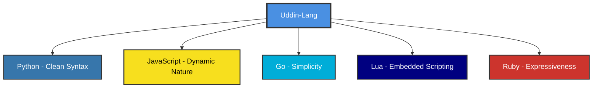
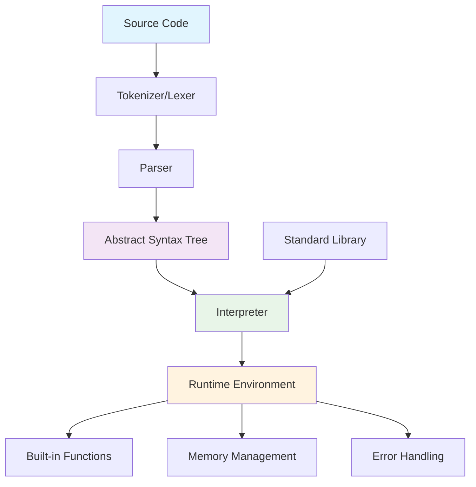
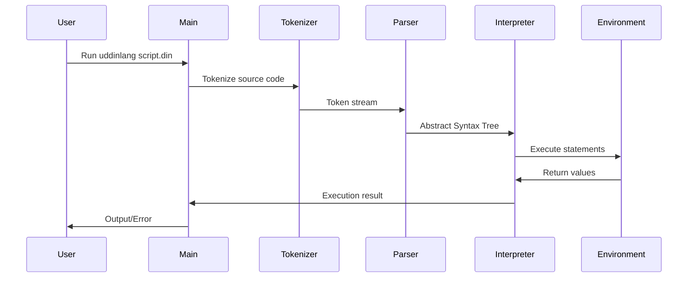

# Uddin-Lang Programming Language

> **Note**: This project is created for fun and educational purposes, based on excellent resources from:
>
> -   [Crafting Interpreters](https://craftinginterpreters.com/)
> -   [Writing An Interpreter In Go](https://interpreterbook.com/)
> -   [Let's Build A Simple Interpreter](https://ruslanspivak.com/lsbasi-part1/)
> -   [Language Implementation Patterns](https://pragprog.com/titles/tpdsl/language-implementation-patterns/)
> -   [LittleLang - Simple interpreter in Go](https://github.com/benhoyt/littlelang)
> -   [Monkey Language Interpreter in Go](https://github.com/kitasuke/monkey-go)

<div align="center">


**A Modern, Functional Programming Language with Clean Syntax**

[](https://golang.org)
[](LICENSE)
[](tests)

</div>

## 📖 Table of Contents

-   [About Uddin-Lang](#-about-uddin-lang)
-   [Language Philosophy & Inspiration](#-language-philosophy--inspiration)
-   [Key Features](#-key-features)
-   [Quick Start](#-quick-start)
    -   [CLI Features & Development Tools](#️-cli-features--development-tools)
    -   [Development Workflow Use Cases](#-development-workflow-use-cases)
-   [Language Grammar](#-language-grammar)
-   [Architecture Overview](#️-architecture-overview)
-   [Syntax Reference](#-syntax-reference)
-   [Error Reporting & Debugging](#-error-reporting--debugging)
-   [Module System](#module-system)
-   [Built-in Functions](#-built-in-functions)
-   [Development](#️-development)
-   [Contributing](#-contributing)

---

## 🌟 About Uddin-Lang

Uddin-Lang is a modern, interpreted scripting language designed with simplicity, expressiveness, and functional programming principles in mind. It combines the best features of dynamic languages with a clean, readable syntax that makes programming enjoyable and productive.

**Key Highlights:**

-   🚀 **Fast Development Cycle** with built-in syntax analysis and profiling tools
-   🛠️ **Developer-Centric CLI** with comprehensive development workflow support
-   📊 **Performance Monitoring** through integrated profiling capabilities
-   🔍 **Smart Error Reporting** with precise location indicators and context

### 🎭 Language Category

Uddin-Lang can be categorized as:

-   **Primary**: Scripting Language (like Python, JavaScript, Ruby)
-   **Architecture**: Interpreted Language (no compilation required)
-   **Paradigm**: Multi-paradigm (functional, procedural concepts)
-   **Use Cases**: Automation scripts, rapid prototyping, embedded scripting, general programming
-   **Development**: CLI-first with integrated development tools

### 🎯 Design Goals

-   **Simplicity**: Easy to learn and use syntax
-   **Expressiveness**: Powerful language constructs
-   **Functional**: First-class functions and closures
-   **Dynamic**: Dynamic typing with runtime type checking
-   **Safe**: Built-in error handling and null safety concepts
-   **Developer-Friendly**: Clear error messages with precise location indicators
-   **Modern**: Contemporary language features
-   **Tooling-First**: Integrated development tools for enhanced productivity

---

## 💡 Language Philosophy & Inspiration

Uddin-Lang draws inspiration from several programming languages, combining their best features:



### Core Philosophy

1. **"Code should read like natural language"** - Prioritizing readability over brevity
2. **"Functions are first-class citizens"** - Everything is a value, including functions
3. **"Fail fast, fail clearly"** - Clear error messages and early error detection
4. **"Simple things should be simple"** - Common tasks require minimal code

---

## ✨ Key Features

### 🔥 Core Features

-   ✅ **Dynamic Typing** with runtime type checking
-   ✅ **First-class Functions** and closures
-   ✅ **Built-in Data Structures** (Arrays, Maps/Objects)
-   ✅ **Rich Built-in Functions** including enhanced `range()` with Python-like syntax
-   ✅ **Exception Handling** with try-catch blocks
-   ✅ **Advanced Error Reporting** with precise error location and clear explanations
-   ✅ **Loop Control** (break, continue statements)
-   ✅ **Module System** with import statement for importing .din files
-   ✅ **Flexible Comment System** with both single-line (`//`) and multiline (`/* */`) comments
-   ✅ **Functional Programming** paradigms
-   ✅ **Memory Safe** with garbage collection
-   ✅ **Rich Operator Set** including logical XOR and compound assignment operators

### 🛠️ Developer Tools

-   ✅ **Syntax Analysis** (`--analyze`) - Fast syntax checking without execution
-   ✅ **Performance Profiling** (`--profile`) - Detailed execution metrics and timing
-   ✅ **Interactive CLI** with comprehensive help and examples
-   ✅ **Developer-Friendly Error Messages** with source code context
-   ✅ **Multiple Execution Modes** - Analysis, profiling, and standard execution

---

## 🚀 Quick Start

### Installation

```bash
# Clone the repository
git clone https://github.com/bonkzero404/uddin-lang.git
cd uddin-lang

# Build the interpreter
go build -o uddinlang main.go

# Or run directly
go run main.go
```

### Your First Program

Create a file `hello.din`:

```go
// hello.din - Your first Uddin-Lang program
fun main():
    print("Hello, Uddin-Lang! 🚀")

    // Variables and expressions
    name = "World"
    message = "Welcome to " + name
    print(message)

    // Simple function
    fun greet(person):
        return "Hello, " + person + "!"
    end

    print(greet("Developer"))
end
```

Run it:

```bash
./uddinlang hello.din
# or
go run main.go hello.din
```

### Explore Examples

The language comes with comprehensive examples showcasing all features:

```bash
# List all available examples
./uddinlang --examples

# Run specific examples
./uddinlang examples/12_logical_operators.din     # XOR and logical operations
./uddinlang examples/13_assignment_operators.din  # Compound assignments (+=, -=, etc.)
./uddinlang examples/01_hello_world.din          # Basic syntax
./uddinlang examples/03_math_library.din         # Mathematical functions
```

### 🛠️ CLI Features & Development Tools

Uddin-Lang provides powerful command-line tools for development workflow:

#### Syntax Analysis

Check your code syntax without execution - perfect for development and CI/CD:

```bash
# Analyze syntax only (fast feedback)
./uddinlang --analyze script.din
./uddinlang -a script.din

# Example output for valid syntax:
# ✓ Syntax analysis passed - No syntax errors found

# Example output for syntax errors:
# -----------------------------------------------------------
#     if (true):
#              ^
# -----------------------------------------------------------
# Syntax Error: parse error at 6:14: expected then, but got :
```

#### Performance Profiling

Monitor execution performance and optimization metrics:

```bash
# Run with performance profiling
./uddinlang --profile script.din
./uddinlang -p script.din

# Example profiling output:
# Time Program Execution: 254.166µs
# Elapsed Operation: 53 Ops (208525/s)
# Builtin Calls: 8 (31475/s)
# User Calls: 1 (3934/s)
```

#### Available CLI Commands

| Command      | Short | Description                       |
| ------------ | ----- | --------------------------------- |
| `--help`     | `-h`  | Show usage information            |
| `--version`  | `-v`  | Display version information       |
| `--examples` | `-e`  | List all available example files  |
| `--analyze`  | `-a`  | Syntax analysis without execution |
| `--profile`  | `-p`  | Enable performance profiling      |

#### Usage Examples

```bash
# Basic execution
./uddinlang script.din

# Development workflow
./uddinlang --analyze script.din    # Check syntax first
./uddinlang --profile script.din    # Run with performance monitoring

# Flexible flag positioning
./uddinlang script.din --analyze    # Flags can be placed after filename
./uddinlang -a -p script.din        # Multiple flags (analyze takes priority)

# Get help and examples
./uddinlang --help                  # Show usage
./uddinlang --examples              # List example files
./uddinlang --version               # Show version info
```

---

## 🎯 Development Workflow Use Cases

Uddin-Lang CLI tools support various development scenarios:

#### 🔍 **Syntax Validation in CI/CD**

```bash
# Validate all scripts in a project
find . -name "*.din" -exec ./uddinlang --analyze {} \;

# Exit code integration for CI/CD pipelines
./uddinlang --analyze script.din && echo "Syntax OK" || echo "Syntax Error"
```

#### 📊 **Performance Optimization**

```bash
# Before optimization
./uddinlang --profile slow_script.din

# After optimization
./uddinlang --profile optimized_script.din

# Compare execution metrics to measure improvements
```

#### 🚀 **Rapid Development**

```bash
# Edit-check-run cycle
vim script.din                      # Edit script
./uddinlang --analyze script.din     # Quick syntax check
./uddinlang script.din               # Run if syntax is valid
```

#### 🧪 **IDE/Editor Integration**

```bash
# Language servers can use syntax analysis
./uddinlang --analyze file.din 2>&1 | parse_errors

# Real-time syntax highlighting based on analysis results
```

---

## 📝 Language Grammar

### Formal Grammar (EBNF)

```ebnf
program        = { statement }

statement      = expression_stmt
               | assignment
               | if_stmt
               | while_stmt
               | for_stmt
               | function_def
               | return_stmt
               | break_stmt
               | continue_stmt
               | import_stmt
               | try_catch_stmt

expression_stmt = expression
assignment     = IDENTIFIER ( "=" | "+=" | "-=" | "*=" | "/=" | "%=" ) expression
               | subscript ( "=" | "+=" | "-=" | "*=" | "/=" | "%=" ) expression
if_stmt        = "if" "(" expression ")" "then:" block
                 { "else" "if" "(" expression ")" "then:" block }
                 [ "else:" block ] "end"
while_stmt     = "while" "(" expression "):" block "end"
for_stmt       = "for" "(" IDENTIFIER "in" expression "):" block "end"
function_def   = "fun" IDENTIFIER "(" [ parameter_list ] "):" block "end"
return_stmt    = "return" [ expression ]
break_stmt     = "break"
continue_stmt  = "continue"
import_stmt    = "import" STRING
try_catch_stmt = "try:" block "catch" "(" IDENTIFIER "):" block "end"

block          = { statement }
parameter_list = IDENTIFIER { "," IDENTIFIER }


// Lexical Elements
comment        = single_line_comment | multiline_comment
single_line_comment = "//" { any_character_except_newline }
multiline_comment   = "/*" { any_character } "*/"
```

### Operator Precedence (Highest to Lowest)

| Precedence | Operators                    | Associativity | Description                                  |
| ---------- | ---------------------------- | ------------- | -------------------------------------------- |
| 1          | `()` `[]` `.`                | Left          | Function call, Array access, Property access |
| 2          | `not` `-` (unary)            | Right         | Logical NOT, Unary minus                     |
| 3          | `*` `/` `%`                  | Left          | Multiplication, Division, Modulo             |
| 4          | `+` `-`                      | Left          | Addition, Subtraction                        |
| 5          | `<` `<=` `>` `>=`            | Left          | Relational operators                         |
| 6          | `==` `!=`                    | Left          | Equality operators                           |
| 7          | `and`                        | Left          | Logical AND                                  |
| 8          | `xor`                        | Left          | Logical XOR (exclusive or)                   |
| 9          | `or`                         | Left          | Logical OR                                   |
| 10         | `=` `+=` `-=` `*=` `/=` `%=` | Right         | Assignment and compound assignment           |

---

## 🏗️ Architecture Overview

### Interpreter Architecture



### Execution Flow



### Component Responsibilities

| Component       | Responsibility                                            |
| --------------- | --------------------------------------------------------- |
| **Tokenizer**   | Converts source code into tokens (lexical analysis)       |
| **Parser**      | Builds Abstract Syntax Tree from tokens (syntax analysis) |
| **AST**         | Represents program structure in tree form                 |
| **Interpreter** | Executes the AST (semantic analysis & execution)          |
| **Environment** | Manages variable scopes and function calls                |
| **Built-ins**   | Provides standard library functions                       |

---

## 📚 Syntax Reference

### 💬 Comments

Uddin-Lang supports both single-line and multiline comments:

```go
// This is a single-line comment
print("Hello") // End-of-line comment

/* This is a multiline comment
   that can span multiple lines
   and is great for documentation */

x = 10 /* inline multiline comment */ + 5

/*
 * Block-style documentation comment
 * with consistent formatting
 */
fun calculate_area(radius):
    /* Calculate circle area using π × r² */
    return 3.14159 * radius * radius
end
```

**Comment Features:**

-   **Single-line**: Use `//` for comments that extend to end of line
-   **Multiline**: Use `/* */` for comments spanning multiple lines
-   **Inline**: Both comment types can be used inline with code
-   **Documentation**: Multiline comments are perfect for function/code documentation
-   **No nesting**: Multiline comments cannot be nested inside other multiline comments

### 🔢 Variables & Data Types

Variables are dynamically typed and don't need declaration:

```go
// Basic variable assignment
name = "John"
age = 30
is_active = true
score = 95.5
empty_value = null

// Type checking at runtime
print(typeof(name)) // "string"
print(typeof(age)) // "int"
print(typeof(is_active)) // "bool"
print(typeof(score)) // "float"
print(typeof(empty_value)) // "null"
```

#### Supported Data Types

| Type         | Description                 | Example              | Operations              |
| ------------ | --------------------------- | -------------------- | ----------------------- |
| **null**     | Represents absence of value | `null`               | Equality comparison     |
| **bool**     | Boolean values              | `true`, `false`      | Logical operations      |
| **int**      | Integer numbers             | `42`, `-17`          | Arithmetic operations   |
| **float**    | Floating-point numbers      | `3.14`, `-2.5`       | Arithmetic operations   |
| **string**   | Text sequences              | `"Hello"`, `'World'` | Concatenation, indexing |
| **array**    | Ordered collections         | `[1, 2, 3]`          | Indexing, iteration     |
| **object**   | Key-value pairs             | `{name: "John"}`     | Property access         |
| **function** | Callable code blocks        | `fun() -> "result"`  | Function calls          |

### 🔧 Operators

#### Arithmetic Operators

```go
a = 10
b = 3

print(a + b) // 13 - Addition
print(a - b) // 7  - Subtraction
print(a * b) // 30 - Multiplication
print(a / b) // 3.333... - Division
print(a % b) // 1  - Modulo (remainder)
```

#### Comparison Operators

```go
x = 5
y = 10

print(x == y) // false - Equal to
print(x != y) // true  - Not equal to
print(x < y) // true  - Less than
print(x <= y) // true  - Less than or equal
print(x > y) // false - Greater than
print(x >= y) // false - Greater than or equal
```

#### Logical Operators

```go
a = true
b = false

print(a and b)  // false - Logical AND
print(a or b)   // true  - Logical OR
print(a xor b)  // true  - Logical XOR (exclusive or)
print(not a)    // false - Logical NOT
```

#### String Operators

```go
greeting = "Hello"
name = "World"

// Concatenation
message = greeting + " " + name // "Hello World"

// Repetition
stars = "*" * 5 // "*****"

// Membership
has_world = "World" in message // true
```

#### Assignment Operators

```go
// Basic assignment
x = 10
name = "Alice"

// Compound assignment operators
x += 5   // x = x + 5       (addition assignment)
x -= 3   // x = x - 3       (subtraction assignment)
x *= 2   // x = x * 2       (multiplication assignment)
x /= 4   // x = x / 4       (division assignment)
x %= 3   // x = x % 3       (modulo assignment)

// Works with different data types
message = "Hello"
message += " World"  // "Hello World"

arr = [1, 2, 3]
arr += [4, 5]       // [1, 2, 3, 4, 5]
arr *= 2            // [1, 2, 3, 4, 5, 1, 2, 3, 4, 5]

// Works with array/object subscripts
scores = [10, 20, 30]
scores[0] += 5      // scores becomes [15, 20, 30]

player = {"level": 1, "score": 100}
player["score"] += 50   // player becomes {"level": 1, "score": 150}
player["level"] *= 2    // player becomes {"level": 2, "score": 150}
```

### 🎯 Functions

#### Function Definition & Calling

```go
// Basic function definition
fun add(a, b):
    return a + b
end

// Function call
result = add(5, 3)
print(result)  // 8

// Function with multiple return values (via array)
fun divide_with_remainder(dividend, divisor):
    quotient = dividend / divisor
    remainder = dividend % divisor
    return [quotient, remainder]
end

result = divide_with_remainder(17, 5)
print("Quotient:", result[0])   // 3
print("Remainder:", result[1])  // 2
```

#### Anonymous Functions & Higher-Order Functions

```go
// Anonymous function assigned to variable
square = fun(x):
    return x * x
end

print(square(4))  // 16

// Higher-order function example
fun apply_operation(numbers, operation):
    result = []
    for (num in numbers):
        result = result + [operation(num)]
    end
    return result
end

numbers = [1, 2, 3, 4, 5]
squared = apply_operation(numbers, square)
print(squared)  // [1, 4, 9, 16, 25]
```

#### Closures

```go
fun make_counter():
    count = 0
    return fun():
        count = count + 1
        return count
    end
end

counter1 = make_counter()
counter2 = make_counter()

print(counter1())  // 1
print(counter1())  // 2
print(counter2())  // 1 (separate closure)
print(counter1())  // 3
```

### Module System

#### Import Statement

The `import` statement allows you to import functions and variables from other `.din` files:

```go
// Import a library file
import "math_utils.din"

// Now you can use functions from the imported file
result = factorial(5)
print("Factorial of 5:", result)

// Import multiple libraries
import "string_utils.din"
import "array_utils.din"

// Use functions from different libraries
text = "hello"
reversed = reverse(text) // from string_utils.din
numbers = [1, 2, 3, 4, 5]
sum = arraySum(numbers) // from array_utils.din
```

**Features:**

-   Files are imported relative to the current working directory
-   All functions and variables from imported files become available
-   Files are executed once when imported
-   Import statements can be placed anywhere in the code
-   Circular dependencies should be avoided

**Example library file (math_utils.din):**

```go
// Mathematical utility functions
fun factorial(n):
    if (n <= 1) then:
        return 1
    else:
        return n * factorial(n - 1)
    end
end

fun power(base, exp):
    result = 1
    i = 0
    while (i < exp):
        result = result * base
        i = i + 1
    end
    return result
end

print("Math utilities imported!")
```

### 🔄 Control Flow

#### If-Else Statements

```go
age = 18

if (age >= 18) then:
    print("You are an adult")
else if (age >= 13) then:
    print("You are a teenager")
else:
    print("You are a child")
end

// Ternary conditional expression
status = age >= 18 ? "adult" : "minor"
```

#### While Loops

```go
// Basic while loop
count = 0
while (count < 5):
    print("Count:", count)
    count = count + 1
end

// While loop with break
number = 1
while (true):
    if (number > 10) then:
        break
    end
    print(number)
    number = number * 2
end
```

#### For Loops

```go
// Iterate over array
fruits = ["apple", "banana", "orange"]
for (fruit in fruits):
    print("I like", fruit)
end

// Iterate over range
for (i in range(5)):
    print("Number:", i)  // 0, 1, 2, 3, 4
end

// Iterate over range with start and stop
for (i in range(1, 6)):
    print("Number:", i)  // 1, 2, 3, 4, 5
end

// Iterate over range with larger numbers
for (i in range(10, 15)):
    print("Value:", i)  // 10, 11, 12, 13, 14
end

// Iterate over object keys (planned)
// person = {name: "John", age: 30}
// for (key in keys(person)):
//     print(key, ":", person[key])
// end
```

#### Loop Control

```go
// Using continue to skip iterations
for (i in range(10)):
    if (i % 2 == 0) then:
        continue  // Skip even numbers
    end
    print("Odd number:", i)
end

// Using break to exit early
numbers = [1, 2, 3, 4, 5, 6, 7, 8, 9, 10]
for (num in numbers):
    if (num > 5) then:
        break  // Stop when number > 5
    end
    print(num)
end
```

### 📦 Data Structures

#### Arrays

```go
// Array creation
empty_array = []
numbers = [1, 2, 3, 4, 5]
mixed = [1, "hello", true, null]

// Array indexing (0-based)
print(numbers[0])    // 1 (first element)
print(numbers[-1])   // 5 (last element, planned)

// Array methods
append(numbers, 6, 7)           // Add elements
print(len(numbers))             // Get length
print(slice(numbers, 1, 4))     // Get subset [2, 3, 4]

// Array iteration
for (item in numbers):
    print(item)
end
```

#### Objects/Maps

```go
// Object creation
person = {
    name: "John",
    age: 30,
    city: "New York",
}

// Property access
print(person["name"]) // "John"
print(person.name) // "John" (planned)

// Property modification
person["email"] = "john@example.com"
person["age"] = 31

// Dynamic property access
key = "name"
print(person[key]) // "John"
```

### 🛡️ Error Handling

```go
// Basic try-catch
try:
    result = 10 / 0
    print("This won't be printed")
catch (error):
    print("Error caught:", error)
end

// Nested try-catch
try:
    try:
        array = [1, 2, 3]
        print(array[10])  // Index out of bounds
    catch (inner_error):
        print("Inner error:", inner_error)
        throw "Re-throwing error"  // Planned feature
    end
catch (outer_error):
    print("Outer error:", outer_error)
end

// Custom error handling function
fun safe_divide(a, b):
    if (b == 0) then:
        return null
    else:
        return a / b
    end
end

result = safe_divide(10, 0)
if (result == null) then:
    print("Division by zero!")
else:
    print("Result:", result)
end
```

---

## 🚨 Error Reporting & Debugging

Uddin-Lang features a sophisticated error reporting system designed to provide clear, actionable feedback when syntax or runtime errors occur. Every error message includes:

-   **Clear, descriptive error messages** in plain English
-   **Visual error indicators** with a caret (^) pointing to the exact error location
-   **Source line display** showing the problematic code
-   **Context-specific explanations** tailored to the type of error

### Error Message Format

```
Error: <clear description of the problem>
----------------------------------------
Line <number>: <source code line>
               <spaces>^
               <additional context or suggestions>
```

### Syntax Error Examples

#### Missing Block Delimiter

```go
// ❌ Incorrect syntax
if (x > 5) then
    print("x is greater than 5")  // Missing ':'
end

// Error output:
Error: expected ':' after 'then' keyword to start block, got 'print'
----------------------------------------
Line 2: if (x > 5) then
                    ^
Expected ':' to indicate the start of the block.
```

#### Missing Comma in Function Parameters

```go
// ❌ Incorrect syntax
fun calculate(a b c):  // Missing commas
    return a + b + c
end

// Error output:
Error: missing comma ',' between function parameters
----------------------------------------
Line 1: fun calculate(a b c):
                        ^
Function parameters must be separated by commas.
```

#### Invalid Assignment Target

```go
// ❌ Incorrect syntax
10 = x  // Cannot assign to literal

// Error output:
Error: invalid assignment target: only variables and array/object elements can be assigned to
----------------------------------------
Line 1: 10 = x
        ^
Only variables (like 'x') and subscripted expressions (like 'arr[0]' or 'obj.key') can be assigned to.
```

### Runtime Error Examples

#### Array Index Out of Bounds

```go
// ❌ Runtime error
arr = [1, 2, 3]
print(arr[5])  // Index 5 doesn't exist

// Error output:
Error: array index out of bounds: index 5, length 3
----------------------------------------
Line 2: print(arr[5])
                  ^
Array indices must be between 0 and 2 (length-1).
```

#### Division by Zero

```go
// ❌ Runtime error
result = 10 / 0

// Error output:
Error: division by zero
----------------------------------------
Line 1: result = 10 / 0
                     ^
Cannot divide by zero.
```

### Error Types Covered

#### Parser Errors

-   Missing colons (`:`) after control structure keywords
-   Missing commas in parameter/argument lists
-   Invalid assignment targets
-   Malformed expressions and statements
-   Incorrect block syntax
-   Missing parentheses or brackets

#### Runtime Errors

-   Array/object index out of bounds
-   Division by zero
-   Undefined variables or functions
-   Type mismatches in operations
-   Function argument count mismatches

### Best Practices for Error Handling

1. **Read the error message carefully** - Each message is designed to explain exactly what went wrong
2. **Look at the caret position** - The `^` symbol points to the exact location of the problem
3. **Check the expected syntax** - Error messages often suggest what was expected
4. **Use try-catch for runtime errors** - Wrap potentially failing code in try-catch blocks
5. **Validate inputs** - Check user inputs and function parameters before using them

### Error-Free Code Examples

```go
// ✅ Correct syntax with proper error handling
fun safe_divide(a, b):
    if (b == 0) then:
        return null
    else:
        return a / b
    end
end

fun safe_array_access(arr, index):
    if (index >= 0 and index < len(arr)) then:
        return arr[index]
    else:
        return null
    end
end

// Using try-catch for robust error handling
try:
    result = safe_divide(10, user_input)
    if (result != null) then:
        print("Result:", result)
    else:
        print("Cannot divide by zero!")
    end
catch (error):
    print("Unexpected error:", error)
end
```

---

## 📚 Built-in Functions

### Type Conversion Functions

| Function        | Description        | Example                  | Return Type |
| --------------- | ------------------ | ------------------------ | ----------- |
| `int(value)`    | Convert to integer | `int("42")` → `42`       | int         |
| `float(value)`  | Convert to float   | `float("3.14")` → `3.14` | float       |
| `str(value)`    | Convert to string  | `str(42)` → `"42"`       | string      |
| `bool(value)`   | Convert to boolean | `bool(1)` → `true`       | bool        |
| `typeof(value)` | Get type name      | `typeof(42)` → `"int"`   | string      |

### String Functions

| Function                       | Description       | Example                                      |
| ------------------------------ | ----------------- | -------------------------------------------- |
| `len(str)`                     | String length     | `len("hello")` → `5`                         |
| `upper(str)`                   | To uppercase      | `upper("hello")` → `"HELLO"`                 |
| `lower(str)`                   | To lowercase      | `lower("HELLO")` → `"hello"`                 |
| `split(str, sep)`              | Split string      | `split("a,b,c", ",")` → `["a","b","c"]`      |
| `join(array, sep)`             | Join array        | `join(["a","b","c"], ",")` → `"a,b,c"`       |
| `contains(str, substr)`        | Check substring   | `contains("hello", "ell")` → `true`          |
| `substr(str, start, end)`      | Extract substring | `substr("hello", 1, 4)` → `"ell"`            |
| `str_pad(str, len, char)`      | Pad string        | `str_pad("hi", 5, "*")` → `"***hi"`          |
| `is_regex_match(pattern, str)` | Regex match       | `is_regex_match("^[0-9]+$", "123")` → `true` |

### Array Functions

| Function                           | Description      | Example                                             |
| ---------------------------------- | ---------------- | --------------------------------------------------- |
| `len(array)`                       | Array length     | `len([1,2,3])` → `3`                                |
| `append(array, items...)`          | Add items        | `append([1,2], 3, 4)` → `[1,2,3,4]`                 |
| `slice(array, start, end)`         | Extract slice    | `slice([1,2,3,4], 1, 3)` → `[2,3]`                  |
| `sort(array)`                      | Sort in place    | `sort([3,1,2])` → `[1,2,3]`                         |
| `range(n)` or `range(start, stop)` | Create range     | `range(3)` → `[0,1,2]`<br>`range(1, 4)` → `[1,2,3]` |
| `find(array, value)`               | Find index       | `find([1,2,3], 2)` → `1`                            |
| `contains(array, value)`           | Check membership | `contains([1,2,3], 2)` → `true`                     |

### Math Functions

#### Basic Math Operations

| Function         | Description    | Example              | Return Type |
| ---------------- | -------------- | -------------------- | ----------- |
| `abs(x)`         | Absolute value | `abs(-5)` → `5`      | int/float   |
| `max(a, b, ...)` | Maximum value  | `max(1, 5, 3)` → `5` | int/float   |
| `min(a, b, ...)` | Minimum value  | `min(1, 5, 3)` → `1` | int/float   |
| `pow(base, exp)` | Power function | `pow(2, 3)` → `8`    | int/float   |
| `sqrt(x)`        | Square root    | `sqrt(16)` → `4.0`   | float       |
| `cbrt(x)`        | Cube root      | `cbrt(27)` → `3.0`   | float       |

#### Rounding Functions

| Function      | Description               | Example                      | Return Type |
| ------------- | ------------------------- | ---------------------------- | ----------- |
| `round(x)`    | Round to nearest integer  | `round(3.7)` → `4`           | int         |
| `round(x, n)` | Round to n decimal places | `round(3.14159, 2)` → `3.14` | float       |
| `floor(x)`    | Round down (floor)        | `floor(3.7)` → `3`           | int         |
| `ceil(x)`     | Round up (ceiling)        | `ceil(3.2)` → `4`            | int         |
| `trunc(x)`    | Truncate decimal part     | `trunc(3.7)` → `3`           | int         |

#### Trigonometric Functions

| Function      | Description                   | Example                  | Return Type |
| ------------- | ----------------------------- | ------------------------ | ----------- |
| `sin(x)`      | Sine (radians)                | `sin(PI/2)` → `1.0`      | float       |
| `cos(x)`      | Cosine (radians)              | `cos(0)` → `1.0`         | float       |
| `tan(x)`      | Tangent (radians)             | `tan(PI/4)` → `1.0`      | float       |
| `asin(x)`     | Arc sine (returns radians)    | `asin(1)` → `1.5708`     | float       |
| `acos(x)`     | Arc cosine (returns radians)  | `acos(1)` → `0.0`        | float       |
| `atan(x)`     | Arc tangent (returns radians) | `atan(1)` → `0.7854`     | float       |
| `atan2(y, x)` | Arc tangent of y/x            | `atan2(1, 1)` → `0.7854` | float       |

#### Hyperbolic Functions

| Function  | Description        | Example           | Return Type |
| --------- | ------------------ | ----------------- | ----------- |
| `sinh(x)` | Hyperbolic sine    | `sinh(0)` → `0.0` | float       |
| `cosh(x)` | Hyperbolic cosine  | `cosh(0)` → `1.0` | float       |
| `tanh(x)` | Hyperbolic tangent | `tanh(0)` → `0.0` | float       |

#### Logarithmic Functions

| Function        | Description                | Example                | Return Type |
| --------------- | -------------------------- | ---------------------- | ----------- |
| `log(x)`        | Natural logarithm (ln)     | `log(E)` → `1.0`       | float       |
| `log10(x)`      | Base-10 logarithm          | `log10(100)` → `2.0`   | float       |
| `log2(x)`       | Base-2 logarithm           | `log2(8)` → `3.0`      | float       |
| `logb(x, base)` | Logarithm with custom base | `logb(125, 5)` → `3.0` | float       |
| `exp(x)`        | Exponential function (e^x) | `exp(1)` → `2.718...`  | float       |
| `exp2(x)`       | Base-2 exponential (2^x)   | `exp2(3)` → `8.0`      | float       |

#### Statistical Functions

| Function          | Description               | Example                           | Return Type |
| ----------------- | ------------------------- | --------------------------------- | ----------- |
| `sum(array)`      | Sum of array elements     | `sum([1, 2, 3, 4])` → `10`        | int/float   |
| `mean(array)`     | Arithmetic mean (average) | `mean([1, 2, 3, 4])` → `2.5`      | float       |
| `median(array)`   | Median value              | `median([1, 2, 3, 4, 5])` → `3.0` | float       |
| `mode(array)`     | Most frequent value       | `mode([1, 2, 2, 3])` → `2`        | any         |
| `std_dev(array)`  | Standard deviation        | `std_dev([1, 2, 3, 4])` → `1.29`  | float       |
| `variance(array)` | Variance                  | `variance([1, 2, 3, 4])` → `1.67` | float       |

#### Number Theory Functions

| Function           | Description              | Example                         | Return Type |
| ------------------ | ------------------------ | ------------------------------- | ----------- |
| `gcd(a, b)`        | Greatest common divisor  | `gcd(12, 8)` → `4`              | int         |
| `lcm(a, b)`        | Least common multiple    | `lcm(12, 8)` → `24`             | int         |
| `factorial(n)`     | Factorial (n!)           | `factorial(5)` → `120`          | int         |
| `fibonacci(n)`     | Nth Fibonacci number     | `fibonacci(7)` → `13`           | int         |
| `is_prime(n)`      | Check if number is prime | `is_prime(17)` → `true`         | bool        |
| `prime_factors(n)` | List of prime factors    | `prime_factors(12)` → `[2,2,3]` | array       |

#### Random Number Functions

| Function                 | Description                  | Example                           | Return Type |
| ------------------------ | ---------------------------- | --------------------------------- | ----------- |
| `random()`               | Random float between 0 and 1 | `random()` → `0.7234`             | float       |
| `random_int(min, max)`   | Random integer in range      | `random_int(1, 10)` → `7`         | int         |
| `random_float(min, max)` | Random float in range        | `random_float(1.0, 2.0)` → `1.45` | float       |
| `random_choice(array)`   | Random element from array    | `random_choice([1,2,3])` → `2`    | any         |
| `shuffle(array)`         | Shuffle array in place       | `shuffle([1,2,3])` → `[3,1,2]`    | array       |
| `seed_random(seed)`      | Set random seed              | `seed_random(42)`                 | null        |

#### Mathematical Constants

| Constant | Description             | Value           |
| -------- | ----------------------- | --------------- |
| `PI`     | Pi (π)                  | `3.14159265359` |
| `E`      | Euler's number (e)      | `2.71828182846` |
| `TAU`    | Tau (2π)                | `6.28318530718` |
| `PHI`    | Golden ratio (φ)        | `1.61803398875` |
| `LN2`    | Natural logarithm of 2  | `0.69314718056` |
| `LN10`   | Natural logarithm of 10 | `2.30258509299` |
| `SQRT2`  | Square root of 2        | `1.41421356237` |
| `SQRT3`  | Square root of 3        | `1.73205080757` |

### I/O Functions

| Function                    | Description       | Example                           |
| --------------------------- | ----------------- | --------------------------------- |
| `print(values...)`          | Print to console  | `print("Hello", "World")`         |
| `input(prompt)`             | Read user input   | `name = input("Enter name: ")`    |
| `read_file(path)`           | Read file content | `content = read_file("data.txt")` |
| `write_file(path, content)` | Write to file     | `write_file("out.txt", "Hello")`  |

### Utility Functions

| Function                 | Description                | Example                                 |
| ------------------------ | -------------------------- | --------------------------------------- |
| `sign(x)`                | Sign of number (-1, 0, 1)  | `sign(-5)` → `-1`                       |
| `clamp(x, min, max)`     | Clamp value to range       | `clamp(15, 1, 10)` → `10`               |
| `lerp(a, b, t)`          | Linear interpolation       | `lerp(0, 10, 0.5)` → `5.0`              |
| `degrees(radians)`       | Convert radians to degrees | `degrees(PI)` → `180.0`                 |
| `radians(degrees)`       | Convert degrees to radians | `radians(180)` → `3.14159`              |
| `is_nan(x)`              | Check if value is NaN      | `is_nan(0.0/0.0)` → `true`              |
| `is_infinite(x)`         | Check if value is infinite | `is_infinite(1.0/0.0)` → `true`         |
| `date_now()`             | Current timestamp          | `date_now()` → `"2025-06-26T14:30:00Z"` |
| `date_format(date, fmt)` | Format date                | `date_format(date_now(), "YYYY-MM-DD")` |
| `exit(code)`             | Exit program               | `exit(0)`                               |
| `sleep(seconds)`         | Pause execution            | `sleep(1.5)`                            |

---

## 🛠️ Development

### Setting Up Development Environment

```bash
# Clone the repository
git clone https://github.com/bonkzero404/uddin-lang.git
cd uddin-lang

# Install Go dependencies
go mod tidy

# Run tests
go test ./...

# Build the interpreter
go build -o uddinlang main.go
```

### Development Commands

```bash
# Run with file
go run main.go script.din

# Run tests with coverage
go test -cover ./...

# Run specific test
go test -run TestLoopControl ./interpreter

# Format code
go fmt ./...

# Lint code (requires golangci-lint)
golangci-lint run

# Generate documentation
godoc -http=:6060
```

### Testing

The project includes comprehensive tests:

-   **Unit Tests**: Test individual components
-   **Integration Tests**: Test component interaction
-   **Example Tests**: Validate example programs
-   **Benchmark Tests**: Performance measurements

```bash
# Run all tests
go test ./...

# Run tests with verbose output
go test -v ./...

# Run tests with coverage report
go test -cover ./... -coverprofile=coverage.out
go tool cover -html=coverage.out
```

---

## 🤝 Contributing

We welcome contributions! Here's how to get started:

### 1. Fork & Clone

```bash
git clone https://github.com/bonkzero404/uddin-lang.git
cd uddin-lang
```

### 2. Create Feature Branch

```bash
git checkout -b feature/my-new-feature
```

### 3. Make Changes

-   Follow Go coding conventions
-   Add tests for new features
-   Update documentation and examples
-   Ensure all tests pass

### 4. Submit Pull Request

```bash
git commit -m "Add my new feature"
git push origin feature/my-new-feature
```
