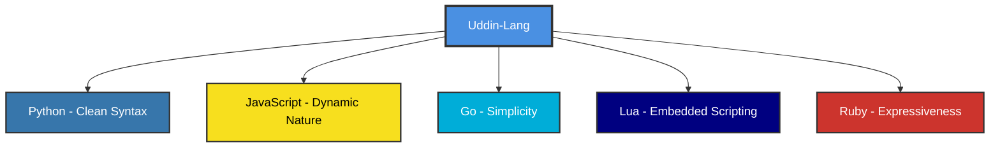
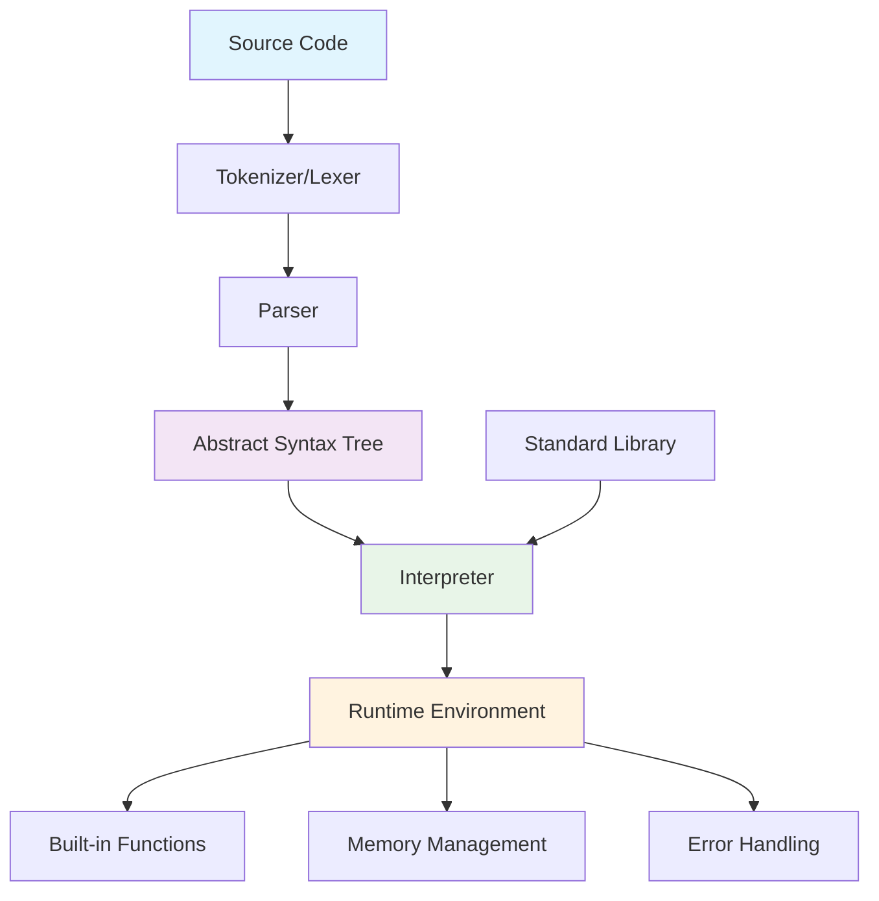
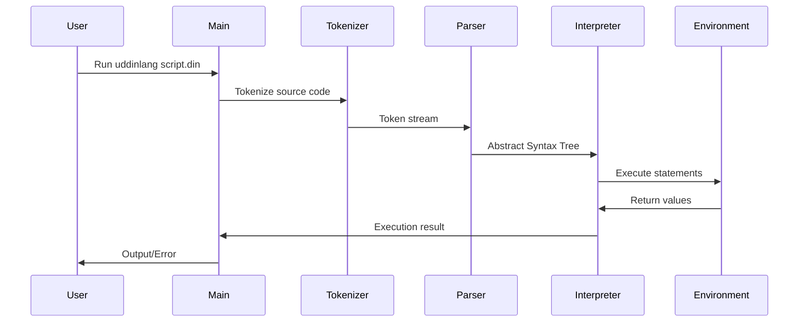

# Uddin-Lang Programming Language

> **Note**: This project is created for fun and educational purposes, based on excellent resources from:
>
> -   [Crafting Interpreters](https://craftinginterpreters.com/)
> -   [Writing An Interpreter In Go](https://interpreterbook.com/)
> -   [Let's Build A Simple Interpreter](https://ruslanspivak.com/lsbasi-part1/)
> -   [Language Implementation Patterns](https://pragprog.com/titles/tpdsl/language-implementation-patterns/)
> -   [LittleLang - Simple interpreter in Go](https://github.com/benhoyt/littlelang)
> -   [Monkey Language Interpreter in Go](https://github.com/kitasuke/monkey-go)

<div align="center">


**A Modern, Functional Programming Language with Clean Syntax**

[](https://golang.org)
[](LICENSE)
[](tests)

</div>

## 📖 Table of Contents

-   [About Uddin-Lang](#about-uddin-lang)
-   [Language Philosophy & Inspiration](#language-philosophy--inspiration)
-   [Key Features](#key-features)
-   [Quick Start](#quick-start)
-   [Language Grammar](#language-grammar)
-   [Architecture Overview](#architecture-overview)
-   [Syntax Reference](#syntax-reference)
-   [Error Reporting & Debugging](#-error-reporting--debugging)
-   [Module System](#module-system)
-   [Built-in Functions](#built-in-functions)
-   [Examples](#examples)
-   [Development](#development)
-   [Contributing](#contributing)
-   [License](#license)

---

## 🌟 About Uddin-Lang

Uddin-Lang is a modern, interpreted programming language designed with simplicity, expressiveness, and functional programming principles in mind. It combines the best features of dynamic languages with a clean, readable syntax that makes programming enjoyable and productive.

### 🎯 Design Goals

-   **Simplicity**: Easy to learn and use syntax
-   **Expressiveness**: Powerful language constructs
-   **Functional**: First-class functions and closures
-   **Dynamic**: Dynamic typing with runtime type checking
-   **Safe**: Built-in error handling and null safety concepts
-   **Developer-Friendly**: Clear error messages with precise location indicators
-   **Modern**: Contemporary language features

---

## 💡 Language Philosophy & Inspiration

Uddin-Lang draws inspiration from several programming languages, combining their best features:



### Core Philosophy

1. **"Code should read like natural language"** - Prioritizing readability over brevity
2. **"Functions are first-class citizens"** - Everything is a value, including functions
3. **"Fail fast, fail clearly"** - Clear error messages and early error detection
4. **"Simple things should be simple"** - Common tasks require minimal code

---

## ✨ Key Features

### 🔥 Core Features

-   ✅ **Dynamic Typing** with runtime type checking
-   ✅ **First-class Functions** and closures
-   ✅ **Built-in Data Structures** (Arrays, Maps/Objects)
-   ✅ **Rich Built-in Functions** including enhanced `range()` with Python-like syntax
-   ✅ **Exception Handling** with try-catch blocks
-   ✅ **Advanced Error Reporting** with precise error location and clear explanations
-   ✅ **Loop Control** (break, continue statements)
-   ✅ **Module System** with import statement for importing .din files
-   ✅ **Functional Programming** paradigms
-   ✅ **Memory Safe** with garbage collection
-   ✅ **Rich Operator Set** including logical XOR and compound assignment operators

---

## 🚀 Quick Start

### Installation

```bash
# Clone the repository
git clone https://github.com/bonkzero404/uddin-lang.git
cd uddin-lang

# Build the interpreter
go build -o uddinlang main.go

# Or run directly
go run main.go
```

### Your First Program

Create a file `hello.din`:

```go
// hello.din - Your first Uddin-Lang program
fun main():
    print("Hello, Uddin-Lang! 🚀")

    // Variables and expressions
    name = "World"
    message = "Welcome to " + name
    print(message)

    // Simple function
    fun greet(person):
        return "Hello, " + person + "!"
    end

    print(greet("Developer"))
end
```

Run it:

```bash
./uddinlang hello.din
# or
go run main.go hello.din
```

### Explore Examples

The language comes with comprehensive examples showcasing all features:

```bash
# List all available examples
./uddinlang --examples

# Run specific examples
./uddinlang examples/12_logical_operators.din     # XOR and logical operations
./uddinlang examples/13_assignment_operators.din  # Compound assignments (+=, -=, etc.)
./uddinlang examples/01_hello_world.din          # Basic syntax
./uddinlang examples/03_math_library.din         # Mathematical functions
```

---

## 📝 Language Grammar

### Formal Grammar (EBNF)

```ebnf
program        = { statement }

statement      = expression_stmt
               | assignment
               | if_stmt
               | while_stmt
               | for_stmt
               | function_def
               | return_stmt
               | break_stmt
               | continue_stmt
               | import_stmt
               | try_catch_stmt

expression_stmt = expression
assignment     = IDENTIFIER ( "=" | "+=" | "-=" | "*=" | "/=" | "%=" ) expression
               | subscript ( "=" | "+=" | "-=" | "*=" | "/=" | "%=" ) expression
if_stmt        = "if" "(" expression ")" "then:" block
                 { "else" "if" "(" expression ")" "then:" block }
                 [ "else:" block ] "end"
while_stmt     = "while" "(" expression "):" block "end"
for_stmt       = "for" "(" IDENTIFIER "in" expression "):" block "end"
function_def   = "fun" IDENTIFIER "(" [ parameter_list ] "):" block "end"
return_stmt    = "return" [ expression ]
break_stmt     = "break"
continue_stmt  = "continue"
import_stmt    = "import" STRING
try_catch_stmt = "try:" block "catch" "(" IDENTIFIER "):" block "end"

block          = { statement }
parameter_list = IDENTIFIER { "," IDENTIFIER }

expression     = logical_or
logical_or     = logical_xor { "or" logical_xor }
logical_xor    = logical_and { "xor" logical_and }
logical_and    = ternary { "and" ternary }
ternary        = equality [ "?" expression ":" expression ]
equality       = comparison { ( "==" | "!=" ) comparison }
comparison     = term { ( ">" | ">=" | "<" | "<=" ) term }
term           = factor { ( "+" | "-" ) factor }
factor         = unary { ( "*" | "/" | "%" ) unary }
unary          = ( "not" | "-" ) unary | call
call           = primary { "(" [ argument_list ] ")" | "[" expression "]" | "." IDENTIFIER }
primary        = NUMBER | STRING | BOOLEAN | "null" | IDENTIFIER
               | "(" expression ")"
               | array_literal
               | object_literal
               | function_literal

array_literal  = "[" [ expression { "," expression } ] "]"
object_literal = "{" [ object_pair { "," object_pair } ] "}"
object_pair    = ( IDENTIFIER | STRING ) ":" expression
function_literal = "fun" "(" [ parameter_list ] "):" block "end"

argument_list  = expression { "," expression }

IDENTIFIER     = LETTER { LETTER | DIGIT | "_" }
NUMBER         = DIGIT { DIGIT } [ "." DIGIT { DIGIT } ]
STRING         = '"' { CHARACTER } '"' | "'" { CHARACTER } "'"
BOOLEAN        = "true" | "false"
LETTER         = "a" ... "z" | "A" ... "Z"
DIGIT          = "0" ... "9"
CHARACTER      = any character except '"' or "'"
```

### Operator Precedence (Highest to Lowest)

| Precedence | Operators                    | Associativity | Description                                  |
| ---------- | ---------------------------- | ------------- | -------------------------------------------- |
| 1          | `()` `[]` `.`                | Left          | Function call, Array access, Property access |
| 2          | `not` `-` (unary)            | Right         | Logical NOT, Unary minus                     |
| 3          | `*` `/` `%`                  | Left          | Multiplication, Division, Modulo             |
| 4          | `+` `-`                      | Left          | Addition, Subtraction                        |
| 5          | `<` `<=` `>` `>=`            | Left          | Relational operators                         |
| 6          | `==` `!=`                    | Left          | Equality operators                           |
| 7          | `and`                        | Left          | Logical AND                                  |
| 8          | `xor`                        | Left          | Logical XOR (exclusive or)                   |
| 9          | `or`                         | Left          | Logical OR                                   |
| 10         | `=` `+=` `-=` `*=` `/=` `%=` | Right         | Assignment and compound assignment           |

---

## 🏗️ Architecture Overview

### Interpreter Architecture



### Execution Flow



### Component Responsibilities

| Component       | Responsibility                                            |
| --------------- | --------------------------------------------------------- |
| **Tokenizer**   | Converts source code into tokens (lexical analysis)       |
| **Parser**      | Builds Abstract Syntax Tree from tokens (syntax analysis) |
| **AST**         | Represents program structure in tree form                 |
| **Interpreter** | Executes the AST (semantic analysis & execution)          |
| **Environment** | Manages variable scopes and function calls                |
| **Built-ins**   | Provides standard library functions                       |

---

## 📚 Syntax Reference

### 💬 Comments

Comments start with `//` and continue to the end of the line:

```go
// This is a single-line comment
// Multiple lines require multiple // symbols

/*
 * Multi-line comments are planned for future versions
 */
```

### 🔢 Variables & Data Types

Variables are dynamically typed and don't need declaration:

```go
// Basic variable assignment
name = "John"
age = 30
is_active = true
score = 95.5
empty_value = null

// Type checking at runtime
print(typeof(name)) // "string"
print(typeof(age)) // "int"
print(typeof(is_active)) // "bool"
print(typeof(score)) // "float"
print(typeof(empty_value)) // "null"
```

#### Supported Data Types

| Type         | Description                 | Example              | Operations              |
| ------------ | --------------------------- | -------------------- | ----------------------- |
| **null**     | Represents absence of value | `null`               | Equality comparison     |
| **bool**     | Boolean values              | `true`, `false`      | Logical operations      |
| **int**      | Integer numbers             | `42`, `-17`          | Arithmetic operations   |
| **float**    | Floating-point numbers      | `3.14`, `-2.5`       | Arithmetic operations   |
| **string**   | Text sequences              | `"Hello"`, `'World'` | Concatenation, indexing |
| **array**    | Ordered collections         | `[1, 2, 3]`          | Indexing, iteration     |
| **object**   | Key-value pairs             | `{name: "John"}`     | Property access         |
| **function** | Callable code blocks        | `fun() -> "result"`  | Function calls          |

### 🔧 Operators

#### Arithmetic Operators

```go
a = 10
b = 3

print(a + b) // 13 - Addition
print(a - b) // 7  - Subtraction
print(a * b) // 30 - Multiplication
print(a / b) // 3.333... - Division
print(a % b) // 1  - Modulo (remainder)
```

#### Comparison Operators

```go
x = 5
y = 10

print(x == y) // false - Equal to
print(x != y) // true  - Not equal to
print(x < y) // true  - Less than
print(x <= y) // true  - Less than or equal
print(x > y) // false - Greater than
print(x >= y) // false - Greater than or equal
```

#### Logical Operators

```go
a = true
b = false

print(a and b)  // false - Logical AND
print(a or b)   // true  - Logical OR
print(a xor b)  // true  - Logical XOR (exclusive or)
print(not a)    // false - Logical NOT
```

#### String Operators

```go
greeting = "Hello"
name = "World"

// Concatenation
message = greeting + " " + name // "Hello World"

// Repetition
stars = "*" * 5 // "*****"

// Membership
has_world = "World" in message // true
```

#### Assignment Operators

```go
// Basic assignment
x = 10
name = "Alice"

// Compound assignment operators
x += 5   // x = x + 5       (addition assignment)
x -= 3   // x = x - 3       (subtraction assignment)
x *= 2   // x = x * 2       (multiplication assignment)
x /= 4   // x = x / 4       (division assignment)
x %= 3   // x = x % 3       (modulo assignment)

// Works with different data types
message = "Hello"
message += " World"  // "Hello World"

arr = [1, 2, 3]
arr += [4, 5]       // [1, 2, 3, 4, 5]
arr *= 2            // [1, 2, 3, 4, 5, 1, 2, 3, 4, 5]

// Works with array/object subscripts
scores = [10, 20, 30]
scores[0] += 5      // scores becomes [15, 20, 30]

player = {"level": 1, "score": 100}
player["score"] += 50   // player becomes {"level": 1, "score": 150}
player["level"] *= 2    // player becomes {"level": 2, "score": 150}
```

### 🎯 Functions

#### Function Definition & Calling

```go
// Basic function definition
fun add(a, b):
    return a + b
end

// Function call
result = add(5, 3)
print(result)  // 8

// Function with multiple return values (via array)
fun divide_with_remainder(dividend, divisor):
    quotient = dividend / divisor
    remainder = dividend % divisor
    return [quotient, remainder]
end

result = divide_with_remainder(17, 5)
print("Quotient:", result[0])   // 3
print("Remainder:", result[1])  // 2
```

#### Anonymous Functions & Higher-Order Functions

```go
// Anonymous function assigned to variable
square = fun(x):
    return x * x
end

print(square(4))  // 16

// Higher-order function example
fun apply_operation(numbers, operation):
    result = []
    for (num in numbers):
        result = result + [operation(num)]
    end
    return result
end

numbers = [1, 2, 3, 4, 5]
squared = apply_operation(numbers, square)
print(squared)  // [1, 4, 9, 16, 25]
```

#### Closures

```go
fun make_counter():
    count = 0
    return fun():
        count = count + 1
        return count
    end
end

counter1 = make_counter()
counter2 = make_counter()

print(counter1())  // 1
print(counter1())  // 2
print(counter2())  // 1 (separate closure)
print(counter1())  // 3
```

### � Module System

#### Import Statement

The `import` statement allows you to import functions and variables from other `.din` files:

```go
// Import a library file
import "math_utils.din"

// Now you can use functions from the imported file
result = factorial(5)
print("Factorial of 5:", result)

// Import multiple libraries
import "string_utils.din"
import "array_utils.din"

// Use functions from different libraries
text = "hello"
reversed = reverse(text) // from string_utils.din
numbers = [1, 2, 3, 4, 5]
sum = arraySum(numbers) // from array_utils.din
```

**Features:**

-   Files are imported relative to the current working directory
-   All functions and variables from imported files become available
-   Files are executed once when imported
-   Import statements can be placed anywhere in the code
-   Circular dependencies should be avoided

**Example library file (math_utils.din):**

```go
// Mathematical utility functions
fun factorial(n):
    if (n <= 1) then:
        return 1
    else:
        return n * factorial(n - 1)
    end
end

fun power(base, exp):
    result = 1
    i = 0
    while (i < exp):
        result = result * base
        i = i + 1
    end
    return result
end

print("Math utilities imported!")
```

### �🔄 Control Flow

#### If-Else Statements

```go
age = 18

if (age >= 18) then:
    print("You are an adult")
else if (age >= 13) then:
    print("You are a teenager")
else:
    print("You are a child")
end

// Ternary conditional expression
status = age >= 18 ? "adult" : "minor"
```

#### While Loops

```go
// Basic while loop
count = 0
while (count < 5):
    print("Count:", count)
    count = count + 1
end

// While loop with break
number = 1
while (true):
    if (number > 10) then:
        break
    end
    print(number)
    number = number * 2
end
```

#### For Loops

```go
// Iterate over array
fruits = ["apple", "banana", "orange"]
for (fruit in fruits):
    print("I like", fruit)
end

// Iterate over range
for (i in range(5)):
    print("Number:", i)  // 0, 1, 2, 3, 4
end

// Iterate over range with start and stop
for (i in range(1, 6)):
    print("Number:", i)  // 1, 2, 3, 4, 5
end

// Iterate over range with larger numbers
for (i in range(10, 15)):
    print("Value:", i)  // 10, 11, 12, 13, 14
end

// Iterate over object keys (planned)
// person = {name: "John", age: 30}
// for (key in keys(person)):
//     print(key, ":", person[key])
// end
```

#### Loop Control

```go
// Using continue to skip iterations
for (i in range(10)):
    if (i % 2 == 0) then:
        continue  // Skip even numbers
    end
    print("Odd number:", i)
end

// Using break to exit early
numbers = [1, 2, 3, 4, 5, 6, 7, 8, 9, 10]
for (num in numbers):
    if (num > 5) then:
        break  // Stop when number > 5
    end
    print(num)
end
```

### 📦 Data Structures

#### Arrays

```go
// Array creation
empty_array = []
numbers = [1, 2, 3, 4, 5]
mixed = [1, "hello", true, null]

// Array indexing (0-based)
print(numbers[0])    // 1 (first element)
print(numbers[-1])   // 5 (last element, planned)

// Array methods
append(numbers, 6, 7)           // Add elements
print(len(numbers))             // Get length
print(slice(numbers, 1, 4))     // Get subset [2, 3, 4]

// Array iteration
for (item in numbers):
    print(item)
end
```

#### Objects/Maps

```go
// Object creation
person = {
    name: "John",
    age: 30,
    city: "New York",
}

// Property access
print(person["name"]) // "John"
print(person.name) // "John" (planned)

// Property modification
person["email"] = "john@example.com"
person["age"] = 31

// Dynamic property access
key = "name"
print(person[key]) // "John"
```

### 🛡️ Error Handling

```go
// Basic try-catch
try:
    result = 10 / 0
    print("This won't be printed")
catch (error):
    print("Error caught:", error)
end

// Nested try-catch
try:
    try:
        array = [1, 2, 3]
        print(array[10])  // Index out of bounds
    catch (inner_error):
        print("Inner error:", inner_error)
        throw "Re-throwing error"  // Planned feature
    end
catch (outer_error):
    print("Outer error:", outer_error)
end

// Custom error handling function
fun safe_divide(a, b):
    if (b == 0) then:
        return null
    else:
        return a / b
    end
end

result = safe_divide(10, 0)
if (result == null) then:
    print("Division by zero!")
else:
    print("Result:", result)
end
```

---

## 🚨 Error Reporting & Debugging

Uddin-Lang features a sophisticated error reporting system designed to provide clear, actionable feedback when syntax or runtime errors occur. Every error message includes:

-   **Clear, descriptive error messages** in plain English
-   **Visual error indicators** with a caret (^) pointing to the exact error location
-   **Source line display** showing the problematic code
-   **Context-specific explanations** tailored to the type of error

### Error Message Format

```
Error: <clear description of the problem>
----------------------------------------
Line <number>: <source code line>
               <spaces>^
               <additional context or suggestions>
```

### Syntax Error Examples

#### Missing Block Delimiter

```go
// ❌ Incorrect syntax
if (x > 5) then
    print("x is greater than 5")  // Missing ':'
end

// Error output:
Error: expected ':' after 'then' keyword to start block, got 'print'
----------------------------------------
Line 2: if (x > 5) then
                    ^
Expected ':' to indicate the start of the block.
```

#### Missing Comma in Function Parameters

```go
// ❌ Incorrect syntax
fun calculate(a b c):  // Missing commas
    return a + b + c
end

// Error output:
Error: missing comma ',' between function parameters
----------------------------------------
Line 1: fun calculate(a b c):
                        ^
Function parameters must be separated by commas.
```

#### Invalid Assignment Target

```go
// ❌ Incorrect syntax
10 = x  // Cannot assign to literal

// Error output:
Error: invalid assignment target: only variables and array/object elements can be assigned to
----------------------------------------
Line 1: 10 = x
        ^
Only variables (like 'x') and subscripted expressions (like 'arr[0]' or 'obj.key') can be assigned to.
```

### Runtime Error Examples

#### Array Index Out of Bounds

```go
// ❌ Runtime error
arr = [1, 2, 3]
print(arr[5])  // Index 5 doesn't exist

// Error output:
Error: array index out of bounds: index 5, length 3
----------------------------------------
Line 2: print(arr[5])
                  ^
Array indices must be between 0 and 2 (length-1).
```

#### Division by Zero

```go
// ❌ Runtime error
result = 10 / 0

// Error output:
Error: division by zero
----------------------------------------
Line 1: result = 10 / 0
                     ^
Cannot divide by zero.
```

### Error Types Covered

#### Parser Errors

-   Missing colons (`:`) after control structure keywords
-   Missing commas in parameter/argument lists
-   Invalid assignment targets
-   Malformed expressions and statements
-   Incorrect block syntax
-   Missing parentheses or brackets

#### Runtime Errors

-   Array/object index out of bounds
-   Division by zero
-   Undefined variables or functions
-   Type mismatches in operations
-   Function argument count mismatches

### Best Practices for Error Handling

1. **Read the error message carefully** - Each message is designed to explain exactly what went wrong
2. **Look at the caret position** - The `^` symbol points to the exact location of the problem
3. **Check the expected syntax** - Error messages often suggest what was expected
4. **Use try-catch for runtime errors** - Wrap potentially failing code in try-catch blocks
5. **Validate inputs** - Check user inputs and function parameters before using them

### Error-Free Code Examples

```go
// ✅ Correct syntax with proper error handling
fun safe_divide(a, b):
    if (b == 0) then:
        return null
    else:
        return a / b
    end
end

fun safe_array_access(arr, index):
    if (index >= 0 and index < len(arr)) then:
        return arr[index]
    else:
        return null
    end
end

// Using try-catch for robust error handling
try:
    result = safe_divide(10, user_input)
    if (result != null) then:
        print("Result:", result)
    else:
        print("Cannot divide by zero!")
    end
catch (error):
    print("Unexpected error:", error)
end
```

### Development Tips

-   **Use descriptive variable names** to make error messages more helpful
-   **Test edge cases** like empty arrays, null values, and boundary conditions
-   **Implement validation functions** for complex operations
-   **Use meaningful error messages** in your own functions when throwing errors

---

## 📚 Built-in Functions

### Type Conversion Functions

| Function        | Description        | Example                  | Return Type |
| --------------- | ------------------ | ------------------------ | ----------- |
| `int(value)`    | Convert to integer | `int("42")` → `42`       | int         |
| `float(value)`  | Convert to float   | `float("3.14")` → `3.14` | float       |
| `str(value)`    | Convert to string  | `str(42)` → `"42"`       | string      |
| `bool(value)`   | Convert to boolean | `bool(1)` → `true`       | bool        |
| `typeof(value)` | Get type name      | `typeof(42)` → `"int"`   | string      |

### String Functions

| Function                       | Description       | Example                                      |
| ------------------------------ | ----------------- | -------------------------------------------- |
| `len(str)`                     | String length     | `len("hello")` → `5`                         |
| `upper(str)`                   | To uppercase      | `upper("hello")` → `"HELLO"`                 |
| `lower(str)`                   | To lowercase      | `lower("HELLO")` → `"hello"`                 |
| `split(str, sep)`              | Split string      | `split("a,b,c", ",")` → `["a","b","c"]`      |
| `join(array, sep)`             | Join array        | `join(["a","b","c"], ",")` → `"a,b,c"`       |
| `contains(str, substr)`        | Check substring   | `contains("hello", "ell")` → `true`          |
| `substr(str, start, end)`      | Extract substring | `substr("hello", 1, 4)` → `"ell"`            |
| `str_pad(str, len, char)`      | Pad string        | `str_pad("hi", 5, "*")` → `"***hi"`          |
| `is_regex_match(pattern, str)` | Regex match       | `is_regex_match("^[0-9]+$", "123")` → `true` |

### Array Functions

| Function                           | Description      | Example                                             |
| ---------------------------------- | ---------------- | --------------------------------------------------- |
| `len(array)`                       | Array length     | `len([1,2,3])` → `3`                                |
| `append(array, items...)`          | Add items        | `append([1,2], 3, 4)` → `[1,2,3,4]`                 |
| `slice(array, start, end)`         | Extract slice    | `slice([1,2,3,4], 1, 3)` → `[2,3]`                  |
| `sort(array)`                      | Sort in place    | `sort([3,1,2])` → `[1,2,3]`                         |
| `range(n)` or `range(start, stop)` | Create range     | `range(3)` → `[0,1,2]`<br>`range(1, 4)` → `[1,2,3]` |
| `find(array, value)`               | Find index       | `find([1,2,3], 2)` → `1`                            |
| `contains(array, value)`           | Check membership | `contains([1,2,3], 2)` → `true`                     |

#### Range Function Details

The `range()` function is particularly useful for creating sequences of numbers:

```go
// Single argument: range(n) creates [0, 1, 2, ..., n-1]
numbers = range(5)      // [0, 1, 2, 3, 4]
print(numbers)

// Two arguments: range(start, stop) creates [start, start+1, ..., stop-1]
numbers = range(3, 8)   // [3, 4, 5, 6, 7]
print(numbers)

// Empty range when start >= stop
empty = range(5, 5)     // []
print(len(empty))       // 0

// Common use in loops
for (i in range(1, 11)):
    print("Processing item", i)
end
```

### Math Functions

#### Basic Math Operations

| Function         | Description    | Example              | Return Type |
| ---------------- | -------------- | -------------------- | ----------- |
| `abs(x)`         | Absolute value | `abs(-5)` → `5`      | int/float   |
| `max(a, b, ...)` | Maximum value  | `max(1, 5, 3)` → `5` | int/float   |
| `min(a, b, ...)` | Minimum value  | `min(1, 5, 3)` → `1` | int/float   |
| `pow(base, exp)` | Power function | `pow(2, 3)` → `8`    | int/float   |
| `sqrt(x)`        | Square root    | `sqrt(16)` → `4.0`   | float       |
| `cbrt(x)`        | Cube root      | `cbrt(27)` → `3.0`   | float       |

#### Rounding Functions

| Function      | Description               | Example                      | Return Type |
| ------------- | ------------------------- | ---------------------------- | ----------- |
| `round(x)`    | Round to nearest integer  | `round(3.7)` → `4`           | int         |
| `round(x, n)` | Round to n decimal places | `round(3.14159, 2)` → `3.14` | float       |
| `floor(x)`    | Round down (floor)        | `floor(3.7)` → `3`           | int         |
| `ceil(x)`     | Round up (ceiling)        | `ceil(3.2)` → `4`            | int         |
| `trunc(x)`    | Truncate decimal part     | `trunc(3.7)` → `3`           | int         |

#### Trigonometric Functions

| Function      | Description                   | Example                  | Return Type |
| ------------- | ----------------------------- | ------------------------ | ----------- |
| `sin(x)`      | Sine (radians)                | `sin(PI/2)` → `1.0`      | float       |
| `cos(x)`      | Cosine (radians)              | `cos(0)` → `1.0`         | float       |
| `tan(x)`      | Tangent (radians)             | `tan(PI/4)` → `1.0`      | float       |
| `asin(x)`     | Arc sine (returns radians)    | `asin(1)` → `1.5708`     | float       |
| `acos(x)`     | Arc cosine (returns radians)  | `acos(1)` → `0.0`        | float       |
| `atan(x)`     | Arc tangent (returns radians) | `atan(1)` → `0.7854`     | float       |
| `atan2(y, x)` | Arc tangent of y/x            | `atan2(1, 1)` → `0.7854` | float       |

#### Hyperbolic Functions

| Function  | Description        | Example           | Return Type |
| --------- | ------------------ | ----------------- | ----------- |
| `sinh(x)` | Hyperbolic sine    | `sinh(0)` → `0.0` | float       |
| `cosh(x)` | Hyperbolic cosine  | `cosh(0)` → `1.0` | float       |
| `tanh(x)` | Hyperbolic tangent | `tanh(0)` → `0.0` | float       |

#### Logarithmic Functions

| Function        | Description                | Example                | Return Type |
| --------------- | -------------------------- | ---------------------- | ----------- |
| `log(x)`        | Natural logarithm (ln)     | `log(E)` → `1.0`       | float       |
| `log10(x)`      | Base-10 logarithm          | `log10(100)` → `2.0`   | float       |
| `log2(x)`       | Base-2 logarithm           | `log2(8)` → `3.0`      | float       |
| `logb(x, base)` | Logarithm with custom base | `logb(125, 5)` → `3.0` | float       |
| `exp(x)`        | Exponential function (e^x) | `exp(1)` → `2.718...`  | float       |
| `exp2(x)`       | Base-2 exponential (2^x)   | `exp2(3)` → `8.0`      | float       |

#### Statistical Functions

| Function          | Description               | Example                           | Return Type |
| ----------------- | ------------------------- | --------------------------------- | ----------- |
| `sum(array)`      | Sum of array elements     | `sum([1, 2, 3, 4])` → `10`        | int/float   |
| `mean(array)`     | Arithmetic mean (average) | `mean([1, 2, 3, 4])` → `2.5`      | float       |
| `median(array)`   | Median value              | `median([1, 2, 3, 4, 5])` → `3.0` | float       |
| `mode(array)`     | Most frequent value       | `mode([1, 2, 2, 3])` → `2`        | any         |
| `std_dev(array)`  | Standard deviation        | `std_dev([1, 2, 3, 4])` → `1.29`  | float       |
| `variance(array)` | Variance                  | `variance([1, 2, 3, 4])` → `1.67` | float       |

#### Number Theory Functions

| Function           | Description              | Example                         | Return Type |
| ------------------ | ------------------------ | ------------------------------- | ----------- |
| `gcd(a, b)`        | Greatest common divisor  | `gcd(12, 8)` → `4`              | int         |
| `lcm(a, b)`        | Least common multiple    | `lcm(12, 8)` → `24`             | int         |
| `factorial(n)`     | Factorial (n!)           | `factorial(5)` → `120`          | int         |
| `fibonacci(n)`     | Nth Fibonacci number     | `fibonacci(7)` → `13`           | int         |
| `is_prime(n)`      | Check if number is prime | `is_prime(17)` → `true`         | bool        |
| `prime_factors(n)` | List of prime factors    | `prime_factors(12)` → `[2,2,3]` | array       |

#### Random Number Functions

| Function                 | Description                  | Example                           | Return Type |
| ------------------------ | ---------------------------- | --------------------------------- | ----------- |
| `random()`               | Random float between 0 and 1 | `random()` → `0.7234`             | float       |
| `random_int(min, max)`   | Random integer in range      | `random_int(1, 10)` → `7`         | int         |
| `random_float(min, max)` | Random float in range        | `random_float(1.0, 2.0)` → `1.45` | float       |
| `random_choice(array)`   | Random element from array    | `random_choice([1,2,3])` → `2`    | any         |
| `shuffle(array)`         | Shuffle array in place       | `shuffle([1,2,3])` → `[3,1,2]`    | array       |
| `seed_random(seed)`      | Set random seed              | `seed_random(42)`                 | null        |

#### Mathematical Constants

| Constant | Description             | Value           |
| -------- | ----------------------- | --------------- |
| `PI`     | Pi (π)                  | `3.14159265359` |
| `E`      | Euler's number (e)      | `2.71828182846` |
| `TAU`    | Tau (2π)                | `6.28318530718` |
| `PHI`    | Golden ratio (φ)        | `1.61803398875` |
| `LN2`    | Natural logarithm of 2  | `0.69314718056` |
| `LN10`   | Natural logarithm of 10 | `2.30258509299` |
| `SQRT2`  | Square root of 2        | `1.41421356237` |
| `SQRT3`  | Square root of 3        | `1.73205080757` |

#### Utility Functions

| Function             | Description                | Example                         |
| -------------------- | -------------------------- | ------------------------------- | --------- |
| `sign(x)`            | Sign of number (-1, 0, 1)  | `sign(-5)` → `-1`               | int       |
| `clamp(x, min, max)` | Clamp value to range       | `clamp(15, 1, 10)` → `10`       | int/float |
| `lerp(a, b, t)`      | Linear interpolation       | `lerp(0, 10, 0.5)` → `5.0`      | float     |
| `degrees(radians)`   | Convert radians to degrees | `degrees(PI)` → `180.0`         | float     |
| `radians(degrees)`   | Convert degrees to radians | `radians(180)` → `3.14159`      | float     |
| `is_nan(x)`          | Check if value is NaN      | `is_nan(0.0/0.0)` → `true`      | bool      |
| `is_infinite(x)`     | Check if value is infinite | `is_infinite(1.0/0.0)` → `true` | bool      |

### I/O Functions

| Function                    | Description       | Example                           |
| --------------------------- | ----------------- | --------------------------------- |
| `print(values...)`          | Print to console  | `print("Hello", "World")`         |
| `input(prompt)`             | Read user input   | `name = input("Enter name: ")`    |
| `read_file(path)`           | Read file content | `content = read_file("data.txt")` |
| `write_file(path, content)` | Write to file     | `write_file("out.txt", "Hello")`  |

### Utility Functions

| Function                 | Description       | Example                                 |
| ------------------------ | ----------------- | --------------------------------------- |
| `date_now()`             | Current timestamp | `date_now()` → `"2025-06-26T14:30:00Z"` |
| `date_format(date, fmt)` | Format date       | `date_format(date_now(), "YYYY-MM-DD")` |
| `exit(code)`             | Exit program      | `exit(0)`                               |
| `sleep(seconds)`         | Pause execution   | `sleep(1.5)`                            |

---

## 📚 Examples

### Example 1: Factorial Calculator

```go
// factorial.din - Calculate factorial using recursion
fun factorial(n):
    if (n <= 1) then:
        return 1
    else:
        return n * factorial(n - 1)
    end
end

fun main():
    for (i in range(1, 11)):
        result = factorial(i)
        print("Factorial of " + str(i) + " = " + str(result))
    end
end
```

### Example 2: Object-Oriented Style with Closures

```go
// person.din - Object-oriented programming with closures
fun create_person(name, age):
    // Private variables
    birth_year = 2025 - age

    // Public interface
    return {
        "get_name": fun():
            return name
        end,

        "get_age": fun():
            return age
        end,

        "set_age": fun(new_age):
            age = new_age
            birth_year = 2025 - age
        end,

        "get_birth_year": fun():
            return birth_year
        end,

        "introduce": fun():
            return "Hi, I'm " + name + " and I'm " + str(age) + " years old."
        end,

        "have_birthday": fun():
            age = age + 1
            birth_year = birth_year - 1
            return "Happy birthday! Now " + str(age) + " years old."
        end
    }
end

fun main():
    // Create person objects
    john = create_person("John", 25)
    alice = create_person("Alice", 30)

    // Use the objects
    print(john.introduce())
    print(alice.introduce())

    print(john.have_birthday())
    print("John's birth year:", john.get_birth_year())
end
```

### Example 3: Data Processing Pipeline

```go
// data_processing.din - Functional data processing
fun filter_array(array, predicate):
    result = []
    for (item in array):
        if (predicate(item)) then:
            append(result, item)
        end
    end
    return result
end

fun map_array(array, transform):
    result = []
    for (item in array):
        append(result, transform(item))
    end
    return result
end

fun reduce_array(array, initial, accumulator):
    result = initial
    for (item in array):
        result = accumulator(result, item)
    end
    return result
end

fun main():
    // Sample data
    numbers = [1, 2, 3, 4, 5]

    // Filter even numbers
    is_even = fun(x):
        return x % 2 == 0
    end
    even_numbers = filter_array(numbers, is_even)
    print("Even numbers:", even_numbers)

    // Square the numbers
    square = fun(x):
        return x * x
    end
    squared = map_array(even_numbers, square)
    print("Squared even numbers:", squared)

    // Sum all squared even numbers
    add = fun(a, b):
        return a + b
    end
    sum = reduce_array(squared, 0, add)
    print("Sum of squared even numbers:", sum)
end
```

### Example 4: Error Handling & Validation

```go
// validation.din - Input validation and error handling
fun validate_email(email):
    if (typeof(email) != "string") then:
        return false
    end

    // Simple email validation
    has_at = contains(email, "@")
    has_dot = contains(email, ".")
    not_empty = len(email) > 0

    return has_at and has_dot and not_empty
end

fun safe_parse_int(str):
    try:
        return int(str)
    catch (error):
        return null
    end
end

fun get_user_data():
    try:
        // Get user input (simulated)
        name = "John Doe"
        email = "john@example.com"
        age_str = "25"

        // Validate name
        if (len(name) == 0) then:
            throw "Name cannot be empty"
        end

        // Validate email
        if (not validate_email(email)) then:
            throw "Invalid email format"
        end

        // Parse and validate age
        age = safe_parse_int(age_str)
        if (age == null) then:
            throw "Age must be a valid number"
        end

        if (age < 0 or age > 150) then:
            throw "Age must be between 0 and 150"
        end

        return {
            "name": name,
            "email": email,
            "age": age,
            "valid": true
        }

    catch (error):
        return {
            "error": error,
            "valid": false
        }
    end
end

fun main():
    user_data = get_user_data()

    if (user_data["valid"]) then:
        print("User registered successfully!")
        print("Name:", user_data["name"])
        print("Email:", user_data["email"])
        print("Age:", user_data["age"])
    else:
        print("Registration failed:", user_data["error"])
    end
end
```

### Example 6: Advanced Mathematical Operations

```go
// advanced_math.din - Comprehensive math library usage

fun main():
    print("=== Advanced Mathematical Operations ===")

    // Basic math operations
    numbers = [-5, 3.7, 16, 27]
    print("Numbers:", numbers)

    for (num in numbers):
        print("abs(" + str(num) + ") =", abs(num))
        print("sqrt(" + str(num) + ") =", sqrt(abs(num)))
    end

    // Statistical operations
    data = [1, 2, 3, 4, 5, 6, 7, 8, 9, 10]
    print("\nStatistical Analysis of:", data)
    print("Sum:", sum(data))
    print("Mean:", mean(data))
    print("Median:", median(data))
    print("Standard Deviation:", std_dev(data))
    print("Variance:", variance(data))

    // Trigonometric functions
    print("\n=== Trigonometric Functions ===")
    angles = [0, PI/6, PI/4, PI/3, PI/2]

    for (angle in angles):
        degrees_val = degrees(angle)
        print("Angle:", degrees_val, "degrees")
        print("  sin:", round(sin(angle), 4))
        print("  cos:", round(cos(angle), 4))
        print("  tan:", round(tan(angle), 4))
    end

    // Number theory functions
    print("\n=== Number Theory ===")
    test_numbers = [17, 25, 100]

    for (num in test_numbers):
        print("Number:", num)
        print("  Is Prime:", is_prime(num))
        print("  Factorial:", factorial(min(num, 10))) // Limit for performance
        print("  Prime Factors:", prime_factors(num))
    end

    // Random number generation
    print("\n=== Random Numbers ===")
    seed_random(42) // Set seed for reproducible results

    print("Random float (0-1):", random())
    print("Random int (1-100):", random_int(1, 100))
    print("Random float (1.0-10.0):", random_float(1.0, 10.0))

    choices = ["apple", "banana", "cherry", "date"]
    print("Random choice:", random_choice(choices))

    // Shuffle demonstration
    original = [1, 2, 3, 4, 5]
    shuffled = original // Copy array
    shuffle(shuffled)
    print("Original:", original)
    print("Shuffled:", shuffled)

    // Mathematical constants
    print("\n=== Mathematical Constants ===")
    print("PI =", PI)
    print("E =", E)
    print("TAU =", TAU)
    print("PHI (Golden Ratio) =", PHI)
    print("SQRT2 =", SQRT2)

    // Logarithmic functions
    print("\n=== Logarithmic Functions ===")
    values = [1, 2, 10, 100, 1000]

    for (val in values):
        print("Value:", val)
        print("  ln(" + str(val) + ") =", round(log(val), 4))
        print("  log10(" + str(val) + ") =", round(log10(val), 4))
        print("  log2(" + str(val) + ") =", round(log2(val), 4))
    end

    // Utility functions
    print("\n=== Utility Functions ===")
    test_vals = [-10, 0, 5, 15, 25]

    for (val in test_vals):
        clamped = clamp(val, 0, 10)
        print("clamp(" + str(val) + ", 0, 10) =", clamped)
    end

    // Linear interpolation
    print("Linear interpolation between 0 and 100:")
    for (t in [0.0, 0.25, 0.5, 0.75, 1.0]):
        result = lerp(0, 100, t)
        print("  t=" + str(t) + " -> " + str(result))
    end
end
```

### Example 7: Scientific Calculator

```go
// calculator.din - Advanced scientific calculator

fun calculate_statistics(data):
    if (len(data) == 0) then:
        return null
    end

    sorted_data = sort(data)
    n = len(data)

    return {
        "count": n,
        "sum": sum(data),
        "mean": mean(data),
        "median": median(sorted_data),
        "min": min(data),
        "max": max(data),
        "range": max(data) - min(data),
        "std_dev": std_dev(data),
        "variance": variance(data)
    }
end

fun solve_quadratic(a, b, c):
    // Solve ax² + bx + c = 0
    discriminant = b * b - 4 * a * c

    if (discriminant < 0) then:
        return {
            "real_solutions": 0,
            "complex": true,
            "message": "Complex roots"
        }
    else if (discriminant == 0) then:
        root = -b / (2 * a)
        return {
            "real_solutions": 1,
            "root": root,
            "roots": [root]
        }
    else:
        sqrt_disc = sqrt(discriminant)
        root1 = (-b + sqrt_disc) / (2 * a)
        root2 = (-b - sqrt_disc) / (2 * a)
        return {
            "real_solutions": 2,
            "roots": [root1, root2]
        }
    end
end

fun calculate_fibonacci_sequence(n):
    if (n <= 0) then:
        return []
    else if (n == 1) then:
        return [0]
    else if (n == 2) then:
        return [0, 1]
    end

    sequence = [0, 1]
    for (i in range(2, n)):
        next_fib = sequence[i-1] + sequence[i-2]
        append(sequence, next_fib)
    end

    return sequence
end

fun prime_sieve(limit):
    // Sieve of Eratosthenes
    if (limit < 2) then:
        return []
    end

    // Initialize boolean array
    is_prime = []
    for (i in range(limit + 1)):
        append(is_prime, true)
    end

    is_prime[0] = false
    is_prime[1] = false

    // Sieve algorithm
    p = 2
    while (p * p <= limit):
        if (is_prime[p]) then:
            // Mark multiples as not prime
            multiple = p * p
            while (multiple <= limit):
                is_prime[multiple] = false
                multiple = multiple + p
            end
        end
        p = p + 1
    end

    // Collect prime numbers
    primes = []
    for (i in range(2, limit + 1)):
        if (is_prime[i]) then:
            append(primes, i)
        end
    end

    return primes
end

fun main():
    print("=== Scientific Calculator ===")

    // Statistical analysis
    print("\n1. Statistical Analysis")
    sample_data = [12, 15, 18, 20, 22, 25, 28, 30, 32, 35]
    stats = calculate_statistics(sample_data)

    print("Data:", sample_data)
    print("Statistics:")
    print("  Count:", stats["count"])
    print("  Sum:", stats["sum"])
    print("  Mean:", round(stats["mean"], 2))
    print("  Median:", stats["median"])
    print("  Range:", stats["range"])
    print("  Std Dev:", round(stats["std_dev"], 2))

    // Quadratic equation solver
    print("\n2. Quadratic Equation Solver")
    equations = [
        [1, -5, 6],   // x² - 5x + 6 = 0
        [1, -2, 1],   // x² - 2x + 1 = 0
        [1, 0, 1]     // x² + 1 = 0
    ]

    for (eq in equations):
        a = eq[0]
        b = eq[1]
        c = eq[2]

        print("Solving " + str(a) + "x² + " + str(b) + "x + " + str(c) + " = 0")
        solution = solve_quadratic(a, b, c)

        if (solution["real_solutions"] == 0) then:
            print("  " + solution["message"])
        else if (solution["real_solutions"] == 1) then:
            print("  One root: x =", round(solution["root"], 4))
        else:
            roots = solution["roots"]
            print("  Two roots: x₁ =", round(roots[0], 4), ", x₂ =", round(roots[1], 4))
        end
    end

    // Fibonacci sequence
    print("\n3. Fibonacci Sequence")
    fib_15 = calculate_fibonacci_sequence(15)
    print("First 15 Fibonacci numbers:", fib_15)

    // Prime numbers
    print("\n4. Prime Numbers")
    primes_50 = prime_sieve(50)
    print("Prime numbers up to 50:")
    print(primes_50)
    print("Count of primes up to 50:", len(primes_50))

    // Trigonometric table
    print("\n5. Trigonometric Table")
    print("Angle (°) | Sin    | Cos    | Tan")
    print("----------|--------|--------|--------")

    for (deg in [0, 30, 45, 60, 90]):
        rad = radians(deg)
        sin_val = round(sin(rad), 4)
        cos_val = round(cos(rad), 4)
        tan_val = deg == 90 ? "undefined" : str(round(tan(rad), 4))

        print(str(deg) + "°       | " + str(sin_val) + " | " + str(cos_val) + " | " + tan_val)
    end
end
```

### Example 8: Module System with Import

**Library file (math_lib.din):**

```go
// math_lib.din - Comprehensive mathematical utilities library

// Basic mathematical functions
fun factorial(n):
    if (n <= 1) then:
        return 1
    else:
        return n * factorial(n - 1)
    end
end

fun isPrime(n):
    if (n <= 1) then:
        return false
    end
    if (n <= 3) then:
        return true
    end
    if (n % 2 == 0 or n % 3 == 0) then:
        return false
    end

    i = 5
    while (i * i <= n):
        if (n % i == 0 or n % (i + 2) == 0) then:
            return false
        end
        i = i + 6
    end
    return true
end

// Advanced mathematical operations
fun gcd(a, b):
    while (b != 0):
        temp = b
        b = a % b
        a = temp
    end
    return abs(a)
end

fun lcm(a, b):
    return abs(a * b) / gcd(a, b)
end

fun fibonacci(n):
    if (n <= 0) then:
        return 0
    else if (n == 1) then:
        return 1
    else:
        return fibonacci(n - 1) + fibonacci(n - 2)
    end
end

// Matrix operations
fun create_matrix(rows, cols, default_val):
    matrix = []
    for (i in range(rows)):
        row = []
        for (j in range(cols)):
            append(row, default_val)
        end
        append(matrix, row)
    end
    return matrix
end

fun matrix_multiply(a, b):
    rows_a = len(a)
    cols_a = len(a[0])
    cols_b = len(b[0])

    result = create_matrix(rows_a, cols_b, 0)

    for (i in range(rows_a)):
        for (j in range(cols_b)):
            for (k in range(cols_a)):
                result[i][j] = result[i][j] + a[i][k] * b[k][j]
            end
        end
    end

    return result
end

// Complex number operations (represented as arrays [real, imaginary])
fun complex_add(a, b):
    return [a[0] + b[0], a[1] + b[1]]
end

fun complex_multiply(a, b):
    real = a[0] * b[0] - a[1] * b[1]
    imag = a[0] * b[1] + a[1] * b[0]
    return [real, imag]
end

fun complex_magnitude(c):
    return sqrt(c[0] * c[0] + c[1] * c[1])
end

print("Comprehensive Math library loaded!")
```

**Statistics library (stats_lib.din):**

```go
// stats_lib.din - Statistical analysis functions

fun calculate_mean(data):
    if (len(data) == 0) then:
        return null
    end
    return sum(data) / len(data)
end

fun calculate_median(data):
    if (len(data) == 0) then:
        return null
    end

    sorted_data = sort(data)
    n = len(sorted_data)

    if (n % 2 == 0) then:
        return (sorted_data[n/2 - 1] + sorted_data[n/2]) / 2
    else:
        return sorted_data[n/2]
    end
end

fun calculate_mode(data):
    if (len(data) == 0) then:
        return null
    end

    frequency = {}
    max_count = 0
    mode_value = null

    for (value in data):
        if (frequency[str(value)] == null) then:
            frequency[str(value)] = 1
        else:
            frequency[str(value)] = frequency[str(value)] + 1
        end

        if (frequency[str(value)] > max_count) then:
            max_count = frequency[str(value)]
            mode_value = value
        end
    end

    return mode_value
end

fun calculate_standard_deviation(data):
    if (len(data) <= 1) then:
        return 0
    end

    mean_val = calculate_mean(data)
    sum_squared_diff = 0

    for (value in data):
        diff = value - mean_val
        sum_squared_diff = sum_squared_diff + diff * diff
    end

    variance = sum_squared_diff / (len(data) - 1)
    return sqrt(variance)
end

fun linear_regression(x_data, y_data):
    if (len(x_data) != len(y_data) or len(x_data) < 2) then:
        return null
    end

    n = len(x_data)
    sum_x = sum(x_data)
    sum_y = sum(y_data)
    sum_xy = 0
    sum_x_squared = 0

    for (i in range(n)):
        sum_xy = sum_xy + x_data[i] * y_data[i]
        sum_x_squared = sum_x_squared + x_data[i] * x_data[i]
    end

    slope = (n * sum_xy - sum_x * sum_y) / (n * sum_x_squared - sum_x * sum_x)
    intercept = (sum_y - slope * sum_x) / n

    return {
        "slope": slope,
        "intercept": intercept,
        "equation": "y = " + str(round(slope, 4)) + "x + " + str(round(intercept, 4))
    }
end

print("Statistics library loaded!")
```

**Main file (main.din):**

```go
// main.din - Using multiple mathematical libraries

// Import the mathematical utilities
import "math_lib.din"
import "stats_lib.din"

fun main():
    print("=== Comprehensive Math Demo ===")

    // Basic math operations
    print("\n1. Number Theory Operations:")
    numbers = [5, 17, 20, 23, 24]

    for (num in numbers):
        fact = factorial(min(num, 10))  // Limit factorial for performance
        prime = isPrime(num)
        fib = fibonacci(min(num, 20))   // Limit fibonacci for performance

        print("Number:", num)
        print("  Factorial (if ≤10):", fact)
        print("  Is Prime:", prime)
        print("  Fibonacci (if ≤20):", fib)
        print("")
    end

    // GCD and LCM
    print("2. GCD and LCM Operations:")
    pairs = [[12, 8], [15, 25], [7, 13]]

    for (pair in pairs):
        a = pair[0]
        b = pair[1]
        gcd_val = gcd(a, b)
        lcm_val = lcm(a, b)

        print("GCD(" + str(a) + ", " + str(b) + ") =", gcd_val)
        print("LCM(" + str(a) + ", " + str(b) + ") =", lcm_val)
    end

    // Matrix operations
    print("\n3. Matrix Operations:")
    matrix_a = [[1, 2], [3, 4]]
    matrix_b = [[5, 6], [7, 8]]

    print("Matrix A:", matrix_a)
    print("Matrix B:", matrix_b)

    result = matrix_multiply(matrix_a, matrix_b)
    print("A × B =", result)

    // Complex number operations
    print("\n4. Complex Number Operations:")
    complex1 = [3, 4]   // 3 + 4i
    complex2 = [1, -2]  // 1 - 2i

    print("Complex 1: " + str(complex1[0]) + " + " + str(complex1[1]) + "i")
    print("Complex 2: " + str(complex2[0]) + " + " + str(complex2[1]) + "i")

    sum_complex = complex_add(complex1, complex2)
    product_complex = complex_multiply(complex1, complex2)
    magnitude1 = complex_magnitude(complex1)

    print("Sum:", sum_complex)
    print("Product:", product_complex)
    print("Magnitude of Complex 1:", round(magnitude1, 4))

    // Statistical analysis
    print("\n5. Statistical Analysis:")
    sample_data = [12, 15, 18, 20, 22, 25, 28, 30, 32, 35, 38, 40]

    print("Sample data:", sample_data)
    print("Mean:", round(calculate_mean(sample_data), 2))
    print("Median:", calculate_median(sample_data))
    print("Mode:", calculate_mode([1, 2, 2, 3, 4, 4, 4, 5]))
    print("Standard Deviation:", round(calculate_standard_deviation(sample_data), 2))

    // Linear regression
    print("\n6. Linear Regression:")
    x_values = [1, 2, 3, 4, 5]
    y_values = [2, 4, 6, 8, 10]  // Perfect linear relationship

    regression = linear_regression(x_values, y_values)
    print("X values:", x_values)
    print("Y values:", y_values)
    print("Regression equation:", regression["equation"])
    print("Slope:", round(regression["slope"], 4))
    print("Intercept:", round(regression["intercept"], 4))

    // Prediction using regression
    predict_x = 6
    predict_y = regression["slope"] * predict_x + regression["intercept"]
    print("Prediction for x=" + str(predict_x) + ": y=" + str(round(predict_y, 2)))

    print("\nAll mathematical libraries working perfectly!")
end
```

**Usage:**

```bash
# Run the comprehensive math demo
./uddinlang main.din

# Expected output includes:
# - Number theory calculations
# - Matrix multiplication results
# - Complex number operations
# - Statistical analysis
# - Linear regression with predictions
```

---

## 🔨 Development

### Building from Source

```bash
# Clone repository
git clone https://github.com/bonkzero404/uddin-lang.git
cd uddin-lang

# Install dependencies
go mod tidy

# Run tests
go test ./...

# Build executable
go build -o uddinlang main.go

# Install globally (optional)
go install
```

### Math Library Implementation

The math functions are implemented as built-in functions in the interpreter. Here's how to extend the math library:

#### Adding New Math Functions

1. **Define the function in `interpreter/functions.go`:**

```go
// Add to the built-in functions map
"sqrt": func(args []interface{}) (interface{}, error) {
    if len(args) != 1 {
        return nil, fmt.Errorf("sqrt() takes exactly 1 argument (%d given)", len(args))
    }

    num, err := convertToFloat(args[0])
    if err != nil {
        return nil, fmt.Errorf("sqrt() argument must be a number")
    }

    if num < 0 {
        return nil, fmt.Errorf("sqrt() of negative number")
    }

    return math.Sqrt(num), nil
},
```

2. **Add comprehensive tests in `interpreter/functions_test.go`:**

```go
func TestMathFunctions(t *testing.T) {
    tests := []struct {
        name     string
        input    string
        expected interface{}
    }{
        {"sqrt positive", "sqrt(16)", 4.0},
        {"sqrt decimal", "sqrt(2)", math.Sqrt(2)},
        {"abs negative", "abs(-5)", 5},
        {"abs positive", "abs(5)", 5},
        // Add more test cases...
    }

    for _, tt := range tests {
        t.Run(tt.name, func(t *testing.T) {
            result, err := evaluateExpression(tt.input)
            assert.NoError(t, err)
            assert.Equal(t, tt.expected, result)
        })
    }
}
```

3. **Update documentation and examples**

#### Math Constants Implementation

Constants are defined as global variables in the environment:

```go
// In interpreter/environment.go
func NewGlobalEnvironment() *Environment {
    env := &Environment{
        store: make(map[string]interface{}),
        outer: nil,
    }

    // Mathematical constants
    env.Define("PI", math.Pi)
    env.Define("E", math.E)
    env.Define("TAU", 2 * math.Pi)
    env.Define("PHI", (1 + math.Sqrt(5)) / 2) // Golden ratio
    env.Define("LN2", math.Ln2)
    env.Define("LN10", math.Ln10)
    env.Define("SQRT2", math.Sqrt2)
    env.Define("SQRT3", math.Sqrt(3))

    return env
}
```

### Development Commands

```bash
# Run with file
go run main.go script.din

# Run tests with coverage
go test -cover ./...

# Run specific test
go test -run TestLoopControl ./interpreter

# Format code
go fmt ./...

# Lint code (requires golangci-lint)
golangci-lint run

# Generate documentation
godoc -http=:6060
```

### Testing

The project includes comprehensive tests:

-   **Unit Tests**: Test individual components
-   **Integration Tests**: Test component interaction
-   **Example Tests**: Validate example programs
-   **Benchmark Tests**: Performance measurements

```bash
# Run all tests
go test ./...

# Run tests with verbose output
go test -v ./...

# Run tests with coverage report
go test -cover ./... -coverprofile=coverage.out
go tool cover -html=coverage.out
```

---

## 🤝 Contributing

We welcome contributions! Here's how to get started:

### 1. Fork & Clone

```bash
git clone https://github.com/bonkzero404/uddin-lang.git
cd uddin-lang
```

### 2. Create Feature Branch

```bash
git checkout -b feature/my-new-feature
```

### 3. Make Changes

-   Follow Go coding conventions
-   Add tests for new features
-   Update documentation
-   Ensure all tests pass

### 4. Submit Pull Request

```bash
git commit -m "Add my new feature"
git push origin feature/my-new-feature
```
