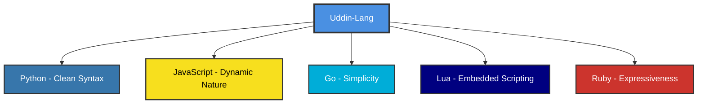
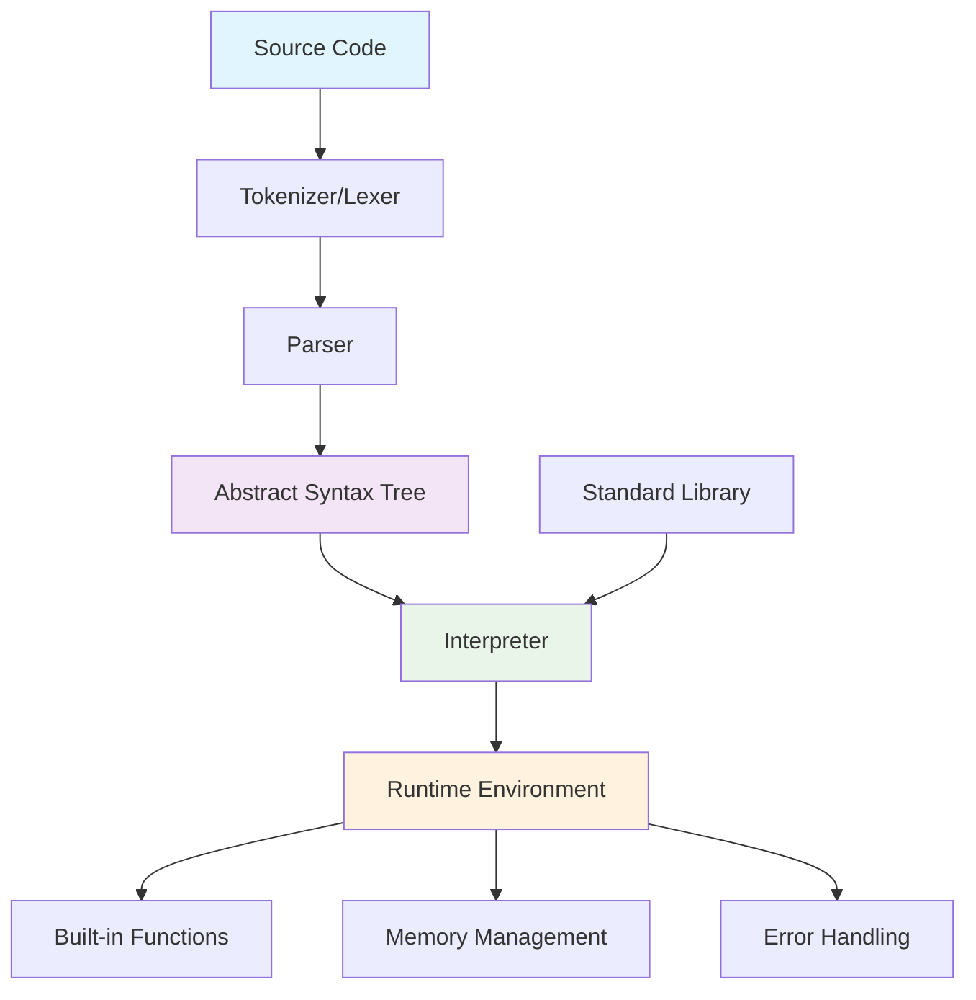
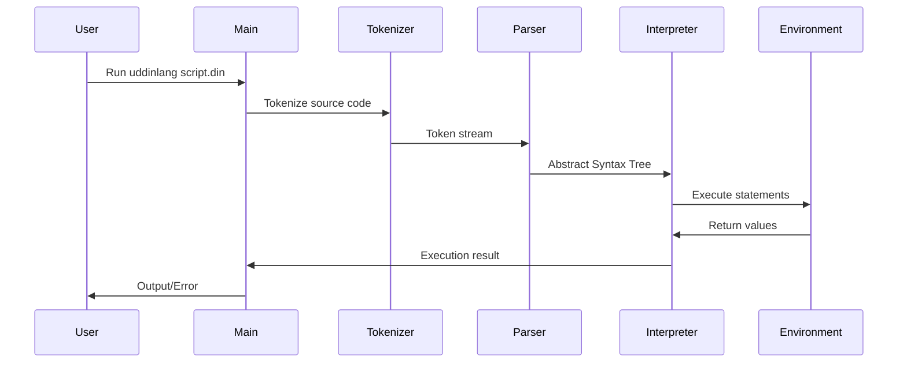

# UDDIN-LANG

> **UDDIN-LANG (Unified Dynamic Decision Interpreter Notation)** - A specialized Flexible Rule Logic Platform that resembles a programming language, offering high expressiveness, full flow control, and runtime programmable capabilities for complex business decision support systems.

<div align="center">


**Flexible Rule Logic Platform with Programming Language Expressiveness**

[](https://golang.org)
[](LICENSE)

[**📚 Read Full Documentation →**](https://bonkzero404.github.io/uddin-lang)

</div>

## 📖 Table of Contents

-   [About UDDIN-LANG](#-about-uddin-lang)
-   [Key Features](#-key-features)
-   [Quick Start](#-quick-start)
    -   [Installation](#installation)
    -   [Your First Program](#your-first-program)
    -   [Explore Examples](#explore-examples)
    -   [CLI Features & Development Tools](#️-cli-features--development-tools)
-   [Development Workflow Use Cases](#-development-workflow-use-cases)
-   [Language Grammar](#-language-grammar)
-   [Architecture Overview](#️-architecture-overview)
-   [Contributing](#-contributing)

---

## 🌟 About UDDIN-LANG

UDDIN-LANG is a specialized rule engine platform designed to bridge the gap between simple rule engines and full programming languages. It combines the power of programming language expressiveness with the simplicity needed for business decision systems.

**🎯 Perfect For:**

-   🛡️ **Security & Anti-fraud** - Multi-factor authentication rules, transaction monitoring, and behavioral analysis systems
-   🤖 **Business Automation** - Approval workflows, document processing, and intelligent routing systems
-   � **Decision Support** - Recommendation engines, risk assessment tools, and dynamic pricing systems
-   ⚖️ **Compliance Rules** - Regulatory compliance engines with audit trails
-   💰 **Financial Logic** - Complex financial calculations and risk management
-   🎯 **Recommendation Systems** - Intelligent content and product recommendations
-   📋 **Data Validation** - Complex validation rules with custom logic

### 🚀 Beyond Simple Rules

Unlike traditional rule engines that limit you to simple if-then logic, UDDIN-LANG provides:

-   **Full Programming Language Power** - Support for loops, functions, and complex logic
-   **Runtime Flexibility** - Modify rules without system restarts
-   **Developer Friendly** - Familiar syntax with powerful debugging capabilities
-   **Enterprise Ready** - Built for scale and performance

### �️ Build Rule Platforms

UDDIN-LANG serves as the foundation for building sophisticated rule management platforms:

-   **Visual Rule Designers** - Drag-and-drop rule creation interfaces
-   **Decision Management Systems** - Enterprise-grade rule management platforms
-   **Workflow Automation** - Complex process rules with branching logic
-   **React Flow Integration** - Perfect backend for visual rule designers

### 🎓 Educational Tool

Ideal for learning programming fundamentals with a focus on decision logic:

-   **Clean Syntax** - Easy to read and understand for beginners
-   **Logic First** - Focus on decision-making and algorithmic thinking
-   **Debugging Friendly** - Clear execution flow for learning

### 💡 Language Philosophy

UDDIN-LANG draws inspiration from multiple paradigms while maintaining focus on rule-based logic:


```mermaid
graph TD
    A[Uddin-Lang] --> B[Python - Clean Syntax]
    A --> C[JavaScript - Dynamic Nature]
    A --> D[Go - Simplicity]
    A --> E[Lua - Embedded Scripting]
    A --> F[Ruby - Expressiveness]

    style A fill:#4a90e2,stroke:#333,stroke-width:3px,color:white
    style B fill:#3776ab,stroke:#333,stroke-width:2px,color:white
    style C fill:#f7df1e,stroke:#333,stroke-width:2px,color:black
    style D fill:#00add8,stroke:#333,stroke-width:2px,color:white
    style E fill:#000080,stroke:#333,stroke-width:2px,color:white
    style F fill:#cc342d,stroke:#333,stroke-width:2px,color:white
```

### Core Philosophy

1. **"Code should read like natural language"** - Prioritizing readability over brevity
2. **"Functions are first-class citizens"** - Everything is a value, including functions
3. **"Fail fast, fail clearly"** - Clear error messages and early error detection
4. **"Simple things should be simple"** - Common tasks require minimal code

---

## ✨ Key Features

### 🔥 Core Features

-   ✅ **Dynamic Typing** with runtime type checking
-   ✅ **First-class Functions** and closures
-   ✅ **Built-in Data Structures** (Arrays, Maps/Objects)
-   ✅ **Rich Built-in Functions** including enhanced `range()` with Python-like syntax
-   ✅ **Exception Handling** with try-catch blocks
-   ✅ **Advanced Error Reporting** with precise error location and clear explanations
-   ✅ **Loop Control** (break, continue statements)
-   ✅ **Module System** with import statement for importing .din files
-   ✅ **Flexible Comment System** with both single-line (`//`) and multiline (`/* */`) comments
-   ✅ **Functional Programming** paradigms
-   ✅ **Memory Safe** with garbage collection
-   ✅ **Rich Operator Set** including logical XOR and compound assignment operators
-   ✅ **Multiline Strings** with backticks for raw text (perfect for JSON, SQL, HTML)
-   ✅ **JSON Support** with built-in parsing and serialization functions
-   ✨ **Extended Standard Library** with advanced string manipulation, functional array methods, and new data structures (Set, Stack, Queue)
-   🌐 **Comprehensive Networking** with HTTP client, TCP/UDP sockets, and network utilities

### 🛠️ Developer Tools

-   ✅ **Syntax Analysis** (`--analyze`) - Fast syntax checking without execution
-   ✅ **Performance Profiling** (`--profile`) - Detailed execution metrics and timing
-   ✅ **Interactive CLI** with comprehensive help and examples
-   ✅ **Developer-Friendly Error Messages** with source code context
-   ✅ **Multiple Execution Modes** - Analysis, profiling, and standard execution

---

**📖 For complete language reference, syntax guide, and advanced examples:**

<div align="center">

[**🌐 Visit Full Documentation**](https://bonkzero404.github.io/uddin-lang)

</div>

---

## 🚀 Quick Start

### Installation

```bash
# Clone the repository
git clone https://github.com/bonkzero404/uddin-lang.git
cd uddin-lang

# Build the interpreter
go build -o uddinlang main.go

# Or run directly
go run main.go
```

### Your First Program

Create a file `hello.din`:

```go
// hello.din - Your first Uddin-Lang program
fun main():
    print("Hello, Uddin-Lang! 🚀")

    // Variables and expressions
    name = "World"
    message = "Welcome to " + name
    print(message)

    // Simple function
    fun greet(person):
        return "Hello, " + person + "!"
    end

    print(greet("Developer"))
end
```

Run it:

```bash
./uddinlang hello.din
# or
go run main.go hello.din
```

### Explore Examples

The language comes with comprehensive examples showcasing all features:

```bash
# List all available examples
./uddinlang --examples

# Run specific examples
./uddinlang examples/12_logical_operators.din     # XOR and logical operations
./uddinlang examples/13_assignment_operators.din  # Compound assignments (+=, -=, etc.)
./uddinlang examples/01_hello_world.din          # Basic syntax
./uddinlang examples/03_math_library.din         # Mathematical functions

# ✨ New Standard Library Examples
./uddinlang examples/14_string_manipulation_demo.din  # Advanced string functions
./uddinlang examples/15_array_methods_demo.din        # Functional array methods
./uddinlang examples/16_data_structures_demo.din      # Set, Stack, Queue usage
./uddinlang examples/20_json_handling_demo.din        # JSON parsing and serialization
./uddinlang examples/21_multiline_strings_demo.din    # Multiline string features

# 🌐 Networking Examples
./uddinlang examples/17_http_client_demo.din      # HTTP client operations
./uddinlang examples/18_networking_demo.din       # TCP/UDP networking and utilities
./uddinlang examples/19_persistent_http_server.din # Persistent HTTP server with main function
```

### 🛠️ CLI Features & Development Tools

Uddin-Lang provides powerful command-line tools for development workflow:

#### Syntax Analysis

Check your code syntax without execution - perfect for development and CI/CD:

```bash
# Analyze syntax only (fast feedback)
./uddinlang --analyze script.din
./uddinlang -a script.din

# Example output for valid syntax:
# ✓ Syntax analysis passed - No syntax errors found

# Example output for syntax errors:
# -----------------------------------------------------------
#     if (true):
#              ^
# -----------------------------------------------------------
# Syntax Error: parse error at 6:14: expected then, but got :
```

#### Performance Profiling

Monitor execution performance and optimization metrics:

```bash
# Run with performance profiling
./uddinlang --profile script.din
./uddinlang -p script.din

# Example profiling output:
# Time Program Execution: 254.166µs
# Elapsed Operation: 53 Ops (208525/s)
# Builtin Calls: 8 (31475/s)
# User Calls: 1 (3934/s)
```

#### Memory Optimization (Experimental)

Enable experimental memory layout optimizations for improved performance:

```bash
# Run with memory optimization
./uddinlang --memory-optimize script.din
./uddinlang -m script.din

# Combine with profiling to see optimization effects
./uddinlang --memory-optimize --profile script.din
```

**⚠️ Important Notes:**
- Memory optimization is **experimental** and may have compatibility issues
- **Not compatible** with concurrent functions (`concurrent_map`, `concurrent_filter`, `concurrent_reduce`)
- Includes optimizations for:
  - Tagged value types for reduced memory overhead
  - Compact environment structures
  - Cache-friendly data layouts
  - Variable lookup caching
  - Expression memoization

**When to use:**
- Sequential processing workloads
- Memory-constrained environments
- Performance-critical applications without concurrency

**When to avoid:**
- Programs using concurrent functions
- Multi-threaded environments
- Production systems requiring stability

#### Available CLI Commands

| Command            | Short | Description                                    |
| ------------------ | ----- | ---------------------------------------------- |
| `--help`           | `-h`  | Show usage information                         |
| `--version`        | `-v`  | Display version information                    |
| `--examples`       | `-e`  | List all available example files               |
| `--analyze`        | `-a`  | Syntax analysis without execution              |
| `--profile`        | `-p`  | Enable performance profiling                   |
| `--memory-optimize`| `-m`  | Enable experimental memory layout optimization |
| `--from_json`      |       | Execute code from JSON AST format             |

#### Usage Examples

```bash
# Basic execution
./uddinlang script.din

# Development workflow
./uddinlang --analyze script.din    # Check syntax first
./uddinlang --profile script.din    # Run with performance monitoring

# Memory optimization (experimental)
./uddinlang --memory-optimize script.din  # Enable memory layout optimization
./uddinlang -m script.din                 # Short form

# JSON AST execution
./uddinlang --from_json script.json  # Execute from JSON AST format

# Flexible flag positioning
./uddinlang script.din --analyze    # Flags can be placed after filename
./uddinlang -a -p script.din        # Multiple flags (analyze takes priority)

# Get help and examples
./uddinlang --help                  # Show usage
./uddinlang --examples              # List example files
./uddinlang --version               # Show version info
```

---

## 🎯 Development Workflow Use Cases

Uddin-Lang CLI tools support various development scenarios:

#### 🔍 **Syntax Validation in CI/CD**

```bash
# Validate all scripts in a project
find . -name "*.din" -exec ./uddinlang --analyze {} \;

# Exit code integration for CI/CD pipelines
./uddinlang --analyze script.din && echo "Syntax OK" || echo "Syntax Error"
```

#### 📊 **Performance Optimization**

```bash
# Before optimization
./uddinlang --profile slow_script.din

# After optimization
./uddinlang --profile optimized_script.din

# Compare execution metrics to measure improvements
```

#### 🚀 **Rapid Development**

```bash
# Edit-check-run cycle
vim script.din                      # Edit script
./uddinlang --analyze script.din     # Quick syntax check
./uddinlang script.din               # Run if syntax is valid
```

#### 🧪 **IDE/Editor Integration**

```bash
# Language servers can use syntax analysis
./uddinlang --analyze file.din 2>&1 | parse_errors

# Real-time syntax highlighting based on analysis results
```

---

## 📝 Language Grammar

### Formal Grammar (EBNF)

```ebnf
program        = { statement }

statement      = expression_stmt
               | assignment
               | if_stmt
               | while_stmt
               | for_stmt
               | function_def
               | return_stmt
               | break_stmt
               | continue_stmt
               | import_stmt
               | try_catch_stmt

expression_stmt = expression
assignment     = IDENTIFIER ( "=" | "+=" | "-=" | "*=" | "/=" | "%=" ) expression
               | subscript ( "=" | "+=" | "-=" | "*=" | "/=" | "%=" ) expression
if_stmt        = "if" "(" expression ")" "then:" block
                 { "else" "if" "(" expression ")" "then:" block }
                 [ "else:" block ] "end"
while_stmt     = "while" "(" expression "):" block "end"
for_stmt       = "for" "(" IDENTIFIER "in" expression "):" block "end"
function_def   = "fun" IDENTIFIER "(" [ parameter_list ] "):" block "end"
return_stmt    = "return" [ expression ]
break_stmt     = "break"
continue_stmt  = "continue"
import_stmt    = "import" STRING
try_catch_stmt = "try:" block "catch" "(" IDENTIFIER "):" block "end"

block          = { statement }
parameter_list = IDENTIFIER { "," IDENTIFIER }


// Lexical Elements
comment        = single_line_comment | multiline_comment
single_line_comment = "//" { any_character_except_newline }
multiline_comment   = "/*" { any_character } "*/"
```

### Operator Precedence (Highest to Lowest)

| Precedence | Operators                    | Associativity | Description                                  |
| ---------- | ---------------------------- | ------------- | -------------------------------------------- |
| 1          | `()` `[]` `.`                | Left          | Function call, Array access, Property access |
| 2          | `not` `-` (unary)            | Right         | Logical NOT, Unary minus                     |
| 3          | `*` `/` `%`                  | Left          | Multiplication, Division, Modulo             |
| 4          | `+` `-`                      | Left          | Addition, Subtraction                        |
| 5          | `<` `<=` `>` `>=`            | Left          | Relational operators                         |
| 6          | `==` `!=`                    | Left          | Equality operators                           |
| 7          | `and`                        | Left          | Logical AND                                  |
| 8          | `xor`                        | Left          | Logical XOR (exclusive or)                   |
| 9          | `or`                         | Left          | Logical OR                                   |
| 10         | `=` `+=` `-=` `*=` `/=` `%=` | Right         | Assignment and compound assignment           |

---

## 🏗️ Architecture Overview

### Interpreter Architecture


```mermaid
graph TB
    A[Source Code] --> B[Tokenizer/Lexer]
    B --> C[Parser]
    C --> D[Abstract Syntax Tree]
    D --> E[Interpreter]
    E --> F[Runtime Environment]

    F --> G[Built-in Functions]
    F --> H[Memory Management]
    F --> I[Error Handling]

    J[Standard Library] --> E

    style A fill:#e1f5fe
    style D fill:#f3e5f5
    style E fill:#e8f5e8
    style F fill:#fff3e0
```

### Execution Flow


```mermaid
sequenceDiagram
    participant U as User
    participant M as Main
    participant T as Tokenizer
    participant P as Parser
    participant I as Interpreter
    participant E as Environment

    U->>M: Run uddinlang script.din
    M->>T: Tokenize source code
    T->>P: Token stream
    P->>I: Abstract Syntax Tree
    I->>E: Execute statements
    E->>I: Return values
    I->>M: Execution result
    M->>U: Output/Error
```

### Component Responsibilities

| Component       | Responsibility                                            |
| --------------- | --------------------------------------------------------- |
| **Tokenizer**   | Converts source code into tokens (lexical analysis)       |
| **Parser**      | Builds Abstract Syntax Tree from tokens (syntax analysis) |
| **AST**         | Represents program structure in tree form                 |
| **Interpreter** | Executes the AST (semantic analysis & execution)          |
| **Environment** | Manages variable scopes and function calls                |
| **Built-ins**   | Provides standard library functions                       |

---

## 🤝 Contributing

We welcome contributions! Here's how to get started:

### 1. Fork & Clone

```bash
git clone https://github.com/bonkzero404/uddin-lang.git
cd uddin-lang
```

### 2. Create Feature Branch

```bash
git checkout -b feature/my-new-feature
```

### 3. Make Changes

-   Follow Go coding conventions
-   Add tests for new features
-   Update documentation and examples
-   Ensure all tests pass

### 4. Submit Pull Request

```bash
git commit -m "Add my new feature"
git push origin feature/my-new-feature
```
