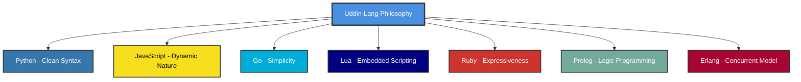
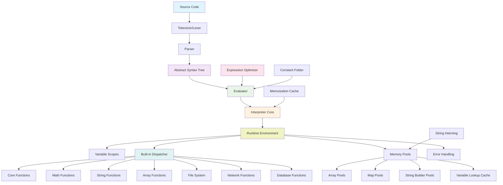
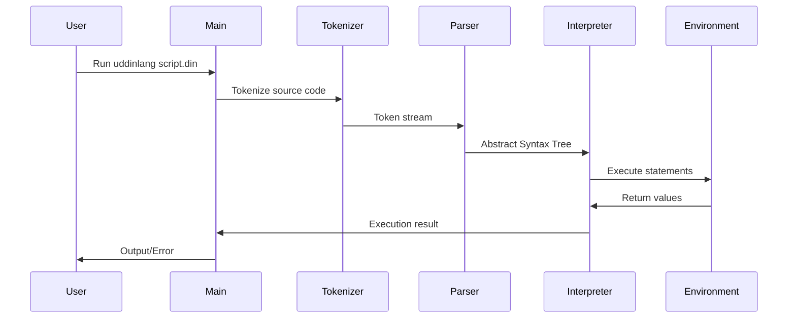

# Language Overview

Welcome to the comprehensive overview of UDDIN-LANG! This section provides an in-depth look at the language's design, formal grammar, and internal architecture.

## Language Philosophy

UDDIN-LANG draws inspiration from multiple programming paradigms while maintaining focus on rule-based logic and business decision systems. The language philosophy is built on four fundamental pillars that guide every design decision:



#### 1. Human-Centric Design

**"Code should read like natural language"** - This principle drives UDDIN-LANG's syntax design, making it accessible to both technical and non-technical stakeholders.

```din
// Natural language-like syntax
if (user.age >= 18 and user.has_valid_id) then:
    grant_access(user)
else:
    deny_access(user, "Age or ID verification failed")
end

// Business rules that read like English
fun calculate_discount(customer, order):
    if (customer.is_premium and order.total > 1000) then:
        return order.total * 0.15  // 15% premium discount
    elif (customer.years_active > 5) then:
        return order.total * 0.10  // 10% loyalty discount
    else:
        return 0  // No discount
    end
end
```

#### 2. Functional-First Approach

**"Functions are first-class citizens"** - Everything in UDDIN-LANG is treated as a value, enabling powerful functional programming patterns while maintaining simplicity.

```din
// Functions as values
operations = {
    "add": fun(a, b): return a + b end,
    "multiply": fun(a, b): return a * b end,
    "power": fun(a, b): return a ** b end
}

// Higher-order functions
fun apply_to_list(numbers, operation):
    result = []
    for (num in numbers):
        result = append(result, operation(num))
    end
    return result
end

// Composition and chaining
processed_data = numbers
    |> filter(fun(x): return x > 0 end)
    |> map(fun(x): return x * 2 end)
    |> reduce(fun(acc, x): return acc + x end, 0)
```

#### 3. Fail-Fast Philosophy

**"Fail fast, fail clearly"** - UDDIN-LANG prioritizes early error detection with comprehensive error messages that help developers understand and fix issues quickly.

```din
// Clear error handling with context
fun process_payment(amount, payment_method):
    // Input validation with descriptive errors
    if (typeof(amount) != "number"):
        throw "Payment amount must be a number, got: " + typeof(amount)
    end
    
    if (amount <= 0):
        throw "Payment amount must be positive, got: " + amount
    end
    
    if (not contains(["credit", "debit", "paypal"], payment_method)):
        throw "Invalid payment method: " + payment_method + ". Supported: credit, debit, paypal"
    end
    
    try:
        return charge_payment(amount, payment_method)
    catch (error):
        throw "Payment processing failed: " + error + " (Amount: " + amount + ", Method: " + payment_method + ")"
    end
end
```

#### 4. Simplicity Over Complexity

**"Simple things should be simple"** - Common programming tasks require minimal code, while complex operations remain possible but don't complicate the basic use cases.

```din
// Simple file operations
content = read_file("data.txt")
lines = split(content, "\n")
write_file("output.txt", join(lines, ", "))

// Simple HTTP requests
response = http_get("https://api.example.com/users")
users = parse_json(response.body)

// Simple database queries
for (user in mysql_stream(db_config, "SELECT * FROM users WHERE active = 1")):
    send_notification(user.email, "Welcome back!")
end

// Complex operations when needed
parallel_results = parallel([
    fun(): return process_chunk(data_chunk_1) end,
    fun(): return process_chunk(data_chunk_2) end,
    fun(): return process_chunk(data_chunk_3) end
])
```

### Design Principles in Practice

#### Readability Over Brevity

UDDIN-LANG chooses explicit, readable syntax over terse expressions:

```din
// Preferred: Clear and explicit
if (user.subscription.is_active and user.subscription.expires_after(today())) then:
    allow_premium_features(user)
end

// Avoided: Terse but unclear
user.sub?.active && user.sub.exp > now() ? premium(user) : null
```

#### Consistency Across Domains

Similar operations follow similar patterns regardless of the domain:

```din
// File operations
for (line in file_stream("large_file.txt")):
    process_line(line)
end

// Database operations
for (row in mysql_stream(config, "SELECT * FROM large_table")):
    process_row(row)
end

// Network operations
for (message in tcp_stream(socket)):
    process_message(message)
end
```

#### Performance Through Optimization, Not Complexity

UDDIN-LANG achieves performance through behind-the-scenes optimizations rather than requiring developers to write complex code:

```din
// Automatic memoization
memo fun fibonacci(n):
    if (n <= 1) then: return n end
    return fibonacci(n-1) + fibonacci(n-2)
end

// Automatic expression optimization
result = (5 * 3) + (10 / 2) - 1  // Computed at parse time: 19

// Automatic memory pooling
large_array = range(1, 1000000)  // Uses object pools internally
```

### Philosophical Influences

#### From Python: Readability and Simplicity
- Clean, indentation-based syntax
- "There should be one obvious way to do it"
- Comprehensive standard library

#### From JavaScript: Dynamic Flexibility
- Dynamic typing with runtime type checking
- First-class functions and closures
- Flexible object manipulation

#### From Go: Simplicity and Performance
- Minimal syntax with powerful features
- Built-in concurrency support
- Fast compilation and execution

#### From Lua: Embeddability
- Lightweight runtime
- Easy integration with host applications
- Minimal dependencies

#### From Ruby: Expressiveness
- Flexible syntax for domain-specific languages
- Powerful metaprogramming capabilities
- Developer happiness focus

#### From Prolog: Logic Programming
- Rule-based reasoning capabilities
- Pattern matching and unification
- Declarative problem solving

#### From Erlang: Fault Tolerance
- "Let it crash" philosophy with proper error handling
- Isolated execution contexts
- Supervisor-style error recovery

### Language Evolution Philosophy

UDDIN-LANG follows a conservative evolution approach:

1. **Backward Compatibility**: New features don't break existing code
2. **Gradual Enhancement**: Features are added incrementally with community feedback
3. **Real-World Testing**: Features are validated in production environments
4. **Community-Driven**: Language evolution is guided by user needs and feedback

```din
// Example of evolutionary design
// Version 1.0: Basic functions
fun calculate_tax(income):
    return income * 0.2
end

// Version 1.1: Added memoization (backward compatible)
memo fun calculate_tax(income):
    return income * 0.2
end

// Version 1.2: Added async support (backward compatible)
async memo fun calculate_tax(income):
    tax_rate = await(fetch_current_tax_rate())
    return income * tax_rate
end
```

### Core Design Principles

1. **"Code should read like natural language"** - Prioritizing readability over brevity
2. **"Functions are first-class citizens"** - Everything is a value, including functions
3. **"Fail fast, fail clearly"** - Clear error messages and early error detection
4. **"Simple things should be simple"** - Common tasks require minimal code

## Language Grammar (EBNF)

UDDIN-LANG follows a formal grammar specification defined in Extended Backus-Naur Form (EBNF). Understanding this grammar helps you write syntactically correct programs and understand how the language parser works.

### Program Structure

```ebnf
// Program Structure
program        = { statement }

// Statements
statement      = expression_stmt
               | assignment
               | if_stmt
               | while_stmt
               | for_stmt
               | function_def
               | memo_function_def
               | return_stmt
               | break_stmt
               | continue_stmt
               | import_stmt
               | try_catch_stmt
```

### Control Flow Statements

```ebnf
if_stmt        = "if" "(" expression ")" "then" ":" block
                   { ( "else" "if" | "elif" ) "(" expression ")" "then" ":" block }
                   [ "else" ":" block ] "end"

while_stmt     = "while" "(" expression ")" ":" block "end"

for_stmt       = "for" "(" IDENTIFIER "in" expression ")" ":" block "end"

try_catch_stmt = "try" ":" block "catch" "(" IDENTIFIER ")" ":" block "end"
```

### Function Definitions

```ebnf
function_def   = "fun" IDENTIFIER "(" [ parameter_list ] ")" ":" block "end"

memo_function_def = "memo" "fun" IDENTIFIER "(" [ parameter_list ] ")" ":" block "end"

parameter_list = IDENTIFIER { "," IDENTIFIER } [ "..." ]
```

### Expressions (Operator Precedence)

```ebnf
// Expressions (in precedence order, lowest to highest)
expression     = ternary
ternary        = logical_or [ "?" expression ":" expression ]
logical_or     = logical_xor { "or" logical_xor }
logical_xor    = logical_and { "xor" logical_and }
logical_and    = equality { "and" equality }
equality       = comparison { ( "==" | "!=" ) comparison }
comparison     = addition { ( "<" | "<=" | ">" | ">=" ) addition }
addition       = multiplication { ( "+" | "-" ) multiplication }
multiplication = power { ( "*" | "/" | "%" ) power }
power          = unary [ "**" power ]  // Right associative
unary          = ( "not" | "-" ) unary | postfix
```

### Data Structures

```ebnf
list           = "[" [ expression { "," expression } [ "," ] ] "]"
map            = "{" [ map_entry { "," map_entry } [ "," ] ] "}"
map_entry      = ( IDENTIFIER | STRING | "(" expression ")" ) ":" expression
```

### Literals and Identifiers

```ebnf
literal        = INTEGER
               | FLOAT
               | STRING
               | "true"
               | "false"
               | "null"

IDENTIFIER     = letter { letter | digit | "_" }
INTEGER        = digit { digit }
FLOAT          = digit { digit } "." digit { digit } [ ( "e" | "E" ) [ "+" | "-" ] digit { digit } ]
               | digit { digit } ( "e" | "E" ) [ "+" | "-" ] digit { digit }
STRING         = '"' { string_char } '"'
               | "'" { string_char } "'"
               | '"""' { any_char } '"""'  // Multiline string
```

### Operator Precedence Table

| Precedence | Operators                    | Associativity | Description                                 |
| ---------- | ---------------------------- | ------------- | ------------------------------------------- |
| 1          | `or`                         | Left          | Logical OR                                  |
| 2          | `xor`                        | Left          | Logical XOR                                 |
| 3          | `and`                        | Left          | Logical AND                                 |
| 4          | `==` `!=`                    | Left          | Equality and inequality                     |
| 5          | `<` `<=` `>` `>=`            | Left          | Relational comparison                       |
| 6          | `+` `-`                      | Left          | Addition and subtraction                    |
| 7          | `*` `/` `%`                  | Left          | Multiplication, division, and modulo        |
| 8          | `**`                         | Right         | Exponentiation                              |
| 9          | `not` `-` (unary)            | Right         | Logical NOT and unary minus                 |
| 10         | `()` `[]` `.`                | Left          | Function calls, subscripts, property access |
| 11         | `?:`                         | Right         | Ternary conditional                         |
| 12         | `=` `+=` `-=` `*=` `/=` `%=` | Right         | Assignment and compound assignment          |

## Architecture Overview

UDDIN-LANG is built with a modular, high-performance architecture designed for both educational use and production environments.

### Interpreter Architecture



### Memory Management & Optimization

```mermaid
graph TB
    A[Memory Layout Config] --> B[Tagged Values]
    A --> C[Compact Environment]
    A --> D[Cache-Friendly Structures]

    %% Object Pools
    E[Object Pools] --> F[Array Pool]
    E --> G[Map Pool]
    E --> H[String Builder Pool]
    E --> I[AST Node Pool]

    %% Caching Systems
    J[Caching Layer] --> K[Memoization Cache]
    J --> L[Variable Lookup Cache]
    J --> M[Token Cache]
    J --> N[Parser Cache]

    %% Optimization Engines
    O[Optimization] --> P[Expression Optimizer]
    O --> Q[Constant Folder]
    O --> R[Fast Numeric Evaluator]
    O --> S[String Interning]

    %% Performance Monitoring
    T[Performance Monitor] --> U[Operation Tracking]
    T --> V[Memory Leak Detection]
    T --> W[Call Statistics]

    style A fill:#e3f2fd
    style E fill:#f3e5f5
    style J fill:#e8f5e8
    style O fill:#fff3e0
    style T fill:#fce4ec
```



### Built-in Function System

```mermaid
graph TB
    A[Built-in Dispatcher] --> B[Function Registry]
    B --> C[Argument Validation]
    B --> D[Call Statistics]

    %% Function Categories
    E[Core Functions] --> F[print, len, typeof]
    G[Math Functions] --> H[abs, sqrt, pow, sin, cos]
    I[String Functions] --> J[substr, split, join, contains]
    K[Array Functions] --> L[range, filter, map, reduce]
    M[File System] --> N[read_file, write_file, exists]
    O[Network] --> P[http_get, http_post, tcp_connect]
    Q[Database] --> R[mysql_stream, postgres_stream]
    S[Concurrent] --> T[async, await, parallel]
    U[Data Structure] --> V[stack, queue, heap, graph]

    %% Dispatch Flow
    A --> E
    A --> G
    A --> I
    A --> K
    A --> M
    A --> O
    A --> Q
    A --> S
    A --> U

    %% Optimization
    W[Fast Path] --> X[Type-specific Handlers]
    W --> Y[Specialized Builtins]
    A --> W

    style A fill:#e0f2f1
    style B fill:#f3e5f5
    style W fill:#fff3e0
```



### Execution Flow



## Component Responsibilities

| Component                 | Responsibility                                                   |
| ------------------------- | ---------------------------------------------------------------- |
| **Tokenizer**             | Converts source code into tokens with caching (lexical analysis) |
| **Parser**                | Builds Abstract Syntax Tree from tokens with node pooling        |
| **AST**                   | Represents program structure in optimized tree form              |
| **Evaluator**             | Evaluates expressions with constant folding optimization         |
| **Interpreter Core**      | Orchestrates execution flow and manages global state             |
| **Runtime Environment**   | Manages variable scopes, I/O streams, and execution context      |
| **Built-in Dispatcher**   | Optimized dispatch system for built-in functions                 |
| **Memory Pools**          | Efficient memory allocation and reuse for arrays, maps, strings  |
| **Expression Optimizer**  | Optimizes expressions through constant folding and caching       |
| **Memoization Cache**     | Caches function results for pure functions                       |
| **Variable Lookup Cache** | Accelerates variable resolution in nested scopes                 |
| **String Interning**      | Reduces memory usage by reusing identical strings                |
| **Performance Monitor**   | Tracks operation counts and detects memory leaks                 |

## Advanced Language Features

### Variadic Functions

Functions can accept a variable number of arguments using the ellipsis (`...`) operator:

```din
// Define variadic function
fun sum(numbers...):
    total = 0
    for (num in numbers):
        total += num
    end
    return total
end

// Call with multiple arguments
result = sum(1, 2, 3, 4, 5)

// Call with array spreading
numbers = [1, 2, 3, 4, 5]
result = sum(numbers...)
```

### Memoization

Functions can be memoized for automatic caching using the `memo` keyword:

```din
// Memoized fibonacci function
memo fun fibonacci(n):
    if (n <= 1):
        return n
    end
    return fibonacci(n-1) + fibonacci(n-2)
end
```

### Scientific Notation

Numeric literals support scientific notation:

```din
avogadro = 6.022e23
electron_mass = 9.109e-31
speed_of_light = 2.998E+8
```

### Multiline Strings

Strings can span multiple lines using triple quotes:

```din
json_data = """
{
    "name": "UDDIN-LANG",
    "version": "1.0",
    "features": ["dynamic", "expressive", "fast"]
}
"""
```

## Performance Characteristics

UDDIN-LANG is designed with performance in mind:

-   **Memory Efficient**: Object pooling and string interning reduce garbage collection pressure
-   **Fast Execution**: Optimized evaluator with constant folding and expression optimization
-   **Scalable**: Built-in function dispatcher with type-specific fast paths
-   **Cache-Friendly**: Memory layout optimizations for better CPU cache utilization

## Next Steps

Now that you understand the language overview and architecture, you're ready to dive deeper into specific language features:

-   [Basic Syntax](./basic-syntax) - Learn the fundamental syntax elements
-   [Variables and Data Types](./variables-and-data-types) - Understand UDDIN-LANG's type system
-   [Control Flow](./control-flow) - Master conditional statements and loops
-   [Functions](./functions) - Explore function definitions and advanced features

For more advanced topics, check out the [Advanced Tutorial](../advanced/best-practices) section.
