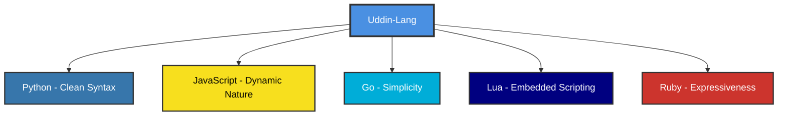
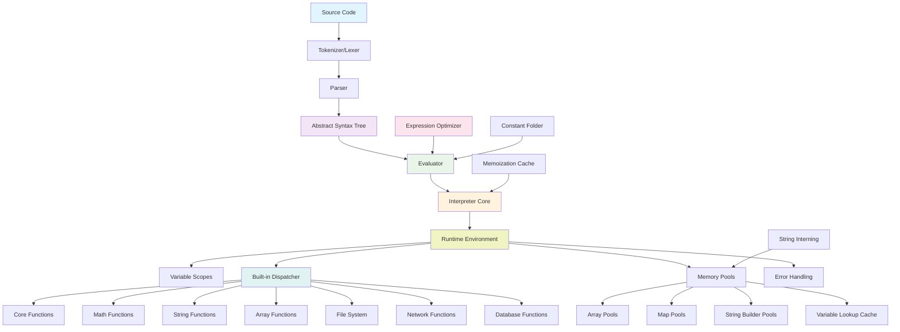
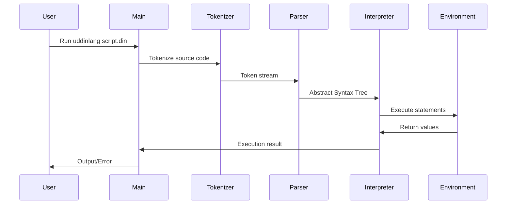

# Language Overview

Welcome to the comprehensive overview of UDDIN-LANG! This section provides an in-depth look at the language's design, formal grammar, and internal architecture.

## What is UDDIN-LANG?

**UDDIN-LANG (Unified Dynamic Decision Interpreter Notation)** is a specialized Flexible Rule Logic Platform that resembles a programming language, offering high expressiveness, full flow control, and runtime programmable capabilities for complex business decision support systems.

### Language Philosophy

UDDIN-LANG draws inspiration from multiple programming paradigms while maintaining focus on rule-based logic:



### Core Design Principles

1. **"Code should read like natural language"** - Prioritizing readability over brevity
2. **"Functions are first-class citizens"** - Everything is a value, including functions
3. **"Fail fast, fail clearly"** - Clear error messages and early error detection
4. **"Simple things should be simple"** - Common tasks require minimal code

## Language Grammar (EBNF)

UDDIN-LANG follows a formal grammar specification defined in Extended Backus-Naur Form (EBNF). Understanding this grammar helps you write syntactically correct programs and understand how the language parser works.

### Program Structure

```ebnf
// Program Structure
program        = { statement }

// Statements
statement      = expression_stmt
               | assignment
               | if_stmt
               | while_stmt
               | for_stmt
               | function_def
               | memo_function_def
               | return_stmt
               | break_stmt
               | continue_stmt
               | import_stmt
               | try_catch_stmt
```

### Control Flow Statements

```ebnf
if_stmt        = "if" "(" expression ")" "then" ":" block
                   { ( "else" "if" | "elif" ) "(" expression ")" "then" ":" block }
                   [ "else" ":" block ] "end"

while_stmt     = "while" "(" expression ")" ":" block "end"

for_stmt       = "for" "(" IDENTIFIER "in" expression ")" ":" block "end"

try_catch_stmt = "try" ":" block "catch" "(" IDENTIFIER ")" ":" block "end"
```

### Function Definitions

```ebnf
function_def   = "fun" IDENTIFIER "(" [ parameter_list ] ")" ":" block "end"

memo_function_def = "memo" "fun" IDENTIFIER "(" [ parameter_list ] ")" ":" block "end"

parameter_list = IDENTIFIER { "," IDENTIFIER } [ "..." ]
```

### Expressions (Operator Precedence)

```ebnf
// Expressions (in precedence order, lowest to highest)
expression     = ternary
ternary        = logical_or [ "?" expression ":" expression ]
logical_or     = logical_xor { "or" logical_xor }
logical_xor    = logical_and { "xor" logical_and }
logical_and    = equality { "and" equality }
equality       = comparison { ( "==" | "!=" ) comparison }
comparison     = addition { ( "<" | "<=" | ">" | ">=" ) addition }
addition       = multiplication { ( "+" | "-" ) multiplication }
multiplication = power { ( "*" | "/" | "%" ) power }
power          = unary [ "**" power ]  // Right associative
unary          = ( "not" | "-" ) unary | postfix
```

### Data Structures

```ebnf
list           = "[" [ expression { "," expression } [ "," ] ] "]"
map            = "{" [ map_entry { "," map_entry } [ "," ] ] "}"
map_entry      = ( IDENTIFIER | STRING | "(" expression ")" ) ":" expression
```

### Literals and Identifiers

```ebnf
literal        = INTEGER
               | FLOAT
               | STRING
               | "true"
               | "false"
               | "null"

IDENTIFIER     = letter { letter | digit | "_" }
INTEGER        = digit { digit }
FLOAT          = digit { digit } "." digit { digit } [ ( "e" | "E" ) [ "+" | "-" ] digit { digit } ]
               | digit { digit } ( "e" | "E" ) [ "+" | "-" ] digit { digit }
STRING         = '"' { string_char } '"'
               | "'" { string_char } "'"
               | '"""' { any_char } '"""'  // Multiline string
```

### Operator Precedence Table

| Precedence | Operators                        | Associativity | Description                                  |
|------------|----------------------------------|---------------|----------------------------------------------|
| 1          | `or`                            | Left          | Logical OR                                   |
| 2          | `xor`                           | Left          | Logical XOR                                  |
| 3          | `and`                           | Left          | Logical AND                                  |
| 4          | `==` `!=`                       | Left          | Equality and inequality                      |
| 5          | `<` `<=` `>` `>=`               | Left          | Relational comparison                        |
| 6          | `+` `-`                         | Left          | Addition and subtraction                     |
| 7          | `*` `/` `%`                     | Left          | Multiplication, division, and modulo         |
| 8          | `**`                            | Right         | Exponentiation                               |
| 9          | `not` `-` (unary)               | Right         | Logical NOT and unary minus                  |
| 10         | `()` `[]` `.`                   | Left          | Function calls, subscripts, property access  |
| 11         | `?:`                            | Right         | Ternary conditional                          |
| 12         | `=` `+=` `-=` `*=` `/=` `%=`    | Right         | Assignment and compound assignment           |

## Architecture Overview

UDDIN-LANG is built with a modular, high-performance architecture designed for both educational use and production environments.

### Interpreter Architecture



### Memory Management & Optimization

```mermaid
graph TB
    A[Memory Layout Config] --> B[Tagged Values]
    A --> C[Compact Environment]
    A --> D[Cache-Friendly Structures]

    %% Object Pools
    E[Object Pools] --> F[Array Pool]
    E --> G[Map Pool]
    E --> H[String Builder Pool]
    E --> I[AST Node Pool]

    %% Caching Systems
    J[Caching Layer] --> K[Memoization Cache]
    J --> L[Variable Lookup Cache]
    J --> M[Token Cache]
    J --> N[Parser Cache]

    %% Optimization Engines
    O[Optimization] --> P[Expression Optimizer]
    O --> Q[Constant Folder]
    O --> R[Fast Numeric Evaluator]
    O --> S[String Interning]

    %% Performance Monitoring
    T[Performance Monitor] --> U[Operation Tracking]
    T --> V[Memory Leak Detection]
    T --> W[Call Statistics]

    style A fill:#e3f2fd
    style E fill:#f3e5f5
    style J fill:#e8f5e8
    style O fill:#fff3e0
    style T fill:#fce4ec
```



### Built-in Function System

```mermaid
graph TB
    A[Built-in Dispatcher] --> B[Function Registry]
    B --> C[Argument Validation]
    B --> D[Call Statistics]

    %% Function Categories
    E[Core Functions] --> F[print, len, typeof]
    G[Math Functions] --> H[abs, sqrt, pow, sin, cos]
    I[String Functions] --> J[substr, split, join, contains]
    K[Array Functions] --> L[range, filter, map, reduce]
    M[File System] --> N[read_file, write_file, exists]
    O[Network] --> P[http_get, http_post, tcp_connect]
    Q[Database] --> R[mysql_stream, postgres_stream]
    S[Concurrent] --> T[async, await, parallel]
    U[Data Structure] --> V[stack, queue, heap, graph]

    %% Dispatch Flow
    A --> E
    A --> G
    A --> I
    A --> K
    A --> M
    A --> O
    A --> Q
    A --> S
    A --> U

    %% Optimization
    W[Fast Path] --> X[Type-specific Handlers]
    W --> Y[Specialized Builtins]
    A --> W

    style A fill:#e0f2f1
    style B fill:#f3e5f5
    style W fill:#fff3e0
```



### Execution Flow



## Component Responsibilities

| Component                | Responsibility                                                    |
| ------------------------ | ----------------------------------------------------------------- |
| **Tokenizer**           | Converts source code into tokens with caching (lexical analysis) |
| **Parser**              | Builds Abstract Syntax Tree from tokens with node pooling        |
| **AST**                 | Represents program structure in optimized tree form              |
| **Evaluator**           | Evaluates expressions with constant folding optimization         |
| **Interpreter Core**    | Orchestrates execution flow and manages global state             |
| **Runtime Environment** | Manages variable scopes, I/O streams, and execution context      |
| **Built-in Dispatcher** | Optimized dispatch system for built-in functions                 |
| **Memory Pools**        | Efficient memory allocation and reuse for arrays, maps, strings  |
| **Expression Optimizer**| Optimizes expressions through constant folding and caching       |
| **Memoization Cache**   | Caches function results for pure functions                       |
| **Variable Lookup Cache**| Accelerates variable resolution in nested scopes                |
| **String Interning**    | Reduces memory usage by reusing identical strings                |
| **Performance Monitor** | Tracks operation counts and detects memory leaks                 |

## Advanced Language Features

### Variadic Functions

Functions can accept a variable number of arguments using the ellipsis (`...`) operator:

```din
// Define variadic function
fun sum(numbers...):
    total = 0
    for (num in numbers):
        total += num
    end
    return total
end

// Call with multiple arguments
result = sum(1, 2, 3, 4, 5)

// Call with array spreading
numbers = [1, 2, 3, 4, 5]
result = sum(numbers...)
```

### Memoization

Functions can be memoized for automatic caching using the `memo` keyword:

```din
// Memoized fibonacci function
memo fun fibonacci(n):
    if (n <= 1):
        return n
    end
    return fibonacci(n-1) + fibonacci(n-2)
end
```

### Scientific Notation

Numeric literals support scientific notation:

```din
avogadro = 6.022e23
electron_mass = 9.109e-31
speed_of_light = 2.998E+8
```

### Multiline Strings

Strings can span multiple lines using triple quotes:

```din
json_data = """
{
    "name": "UDDIN-LANG",
    "version": "1.0",
    "features": ["dynamic", "expressive", "fast"]
}
"""
```

## Performance Characteristics

UDDIN-LANG is designed with performance in mind:

- **Memory Efficient**: Object pooling and string interning reduce garbage collection pressure
- **Fast Execution**: Optimized evaluator with constant folding and expression optimization
- **Scalable**: Built-in function dispatcher with type-specific fast paths
- **Cache-Friendly**: Memory layout optimizations for better CPU cache utilization

## Next Steps

Now that you understand the language overview and architecture, you're ready to dive deeper into specific language features:

- [Basic Syntax](./basic-syntax) - Learn the fundamental syntax elements
- [Variables and Data Types](./variables-and-data-types) - Understand UDDIN-LANG's type system
- [Control Flow](./control-flow) - Master conditional statements and loops
- [Functions](./functions) - Explore function definitions and advanced features

For more advanced topics, check out the [Advanced Tutorial](../advanced/) section.